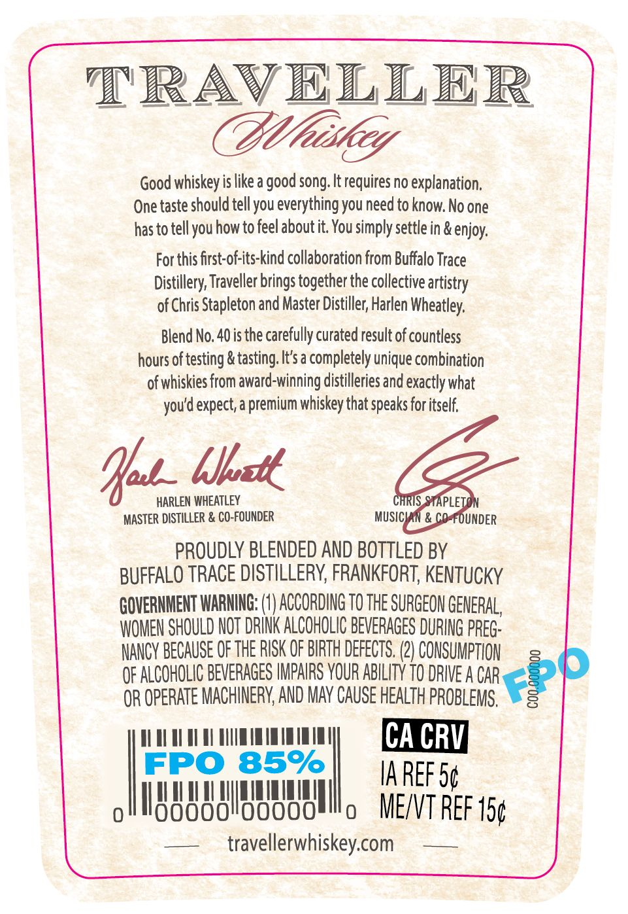
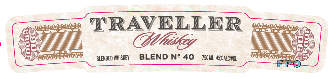
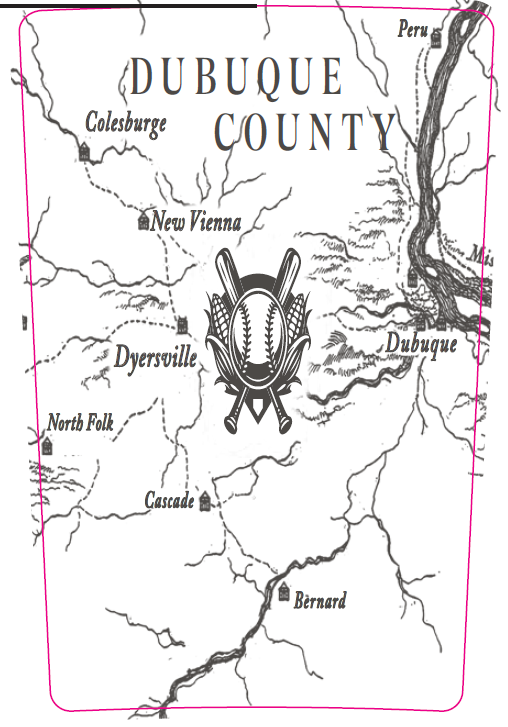

# TTB COLA Label Images - TTBID 26015001000333

**Brand Name:** TRAVELLER

**Fanciful Name:** BLEND NO. 40

**Issue Date:** 01/15/2026

**Origin Code:** 22

**Product Class/Type:** 137

**Source:** [TTB Public COLA Registry](https://ttbonline.gov/colasonline/viewColaDetails.do?action=publicFormDisplay&ttbid=26015001000333)

## Label Images

### Back Label

### Front Label

### Label 3

## Extracted Label Text

*Text extracted via OCR - may contain errors*

### Back Label

Good whiskey is like a good song. It requires no explanation,
One taste should tell you everything you need to know. No one
has to tell you how to feel about it. You simply settle in & enjoy,

For this first-of-its-kind collaboration from Buffalo Trace
Distillery, Traveller brings together the collective artistry
of Chris Stapleton and Master Distiller, Harlen Wheatley,

Blend No. 40 is the carefully curated result of countless
hours of testing & tasting, It's a completely unique combination
of whiskies from award-winning distilleries and exactly what
you'd expect, a premium whiskey that speaks for itself.

hh blast

HARLEN WHEATLEY iTS orf
MASTER DISTILLER & CO-FOUNDER MUSICIAN

PROUDLY BLENDED AND BOTTLED BY
BUFFALO TRACE DISTILLERY, FRANKFORT, KENTUCKY

GOVERNMENT WARNING: (1) ACCORDING TO THE SURGEON GENERAL,
WOMEN SHOULD NOT DRINK ALCOHOLIC BEVERAGES DURING PREG-

NANCY BECAUSE OF THE RISK OF BIRTH DEFECTS. (2) CONSUMPTION =
OF ALCOHOLIC BEVERAGES IMPAIRS YOUR ABILITY 10 DRIVE A CAR

OR OPERATE MACHINERY, AND MAY CAUSE HEALTH PROBLEMS, \s

FPOS iT} ES.
oll IA REF 5g
All stati wana o MET REF 15¢

— _ travellerwhiskey.com ——

### Front Label

y
jus TRAVELLER eee
Shem Gliiitiy init
| eee EA ees
Cer —gnownser BLEND N* 40 ram scum — PPOo Op EY

### Label 3

Peru

4

(DUBUQUE

Wy

a pe UNTY

‘ We Fn

")

3

a4

deme

oes

ira

4 Dyersville

\

\\

Yn 8

Dubuque

W,

sj Norib Folk

RK

wel

hanene

A

ws

8 Bernard
