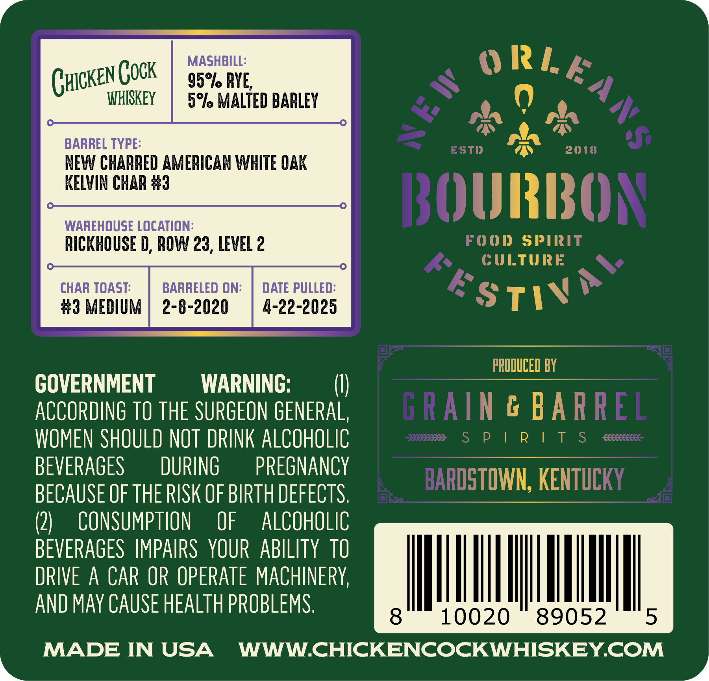
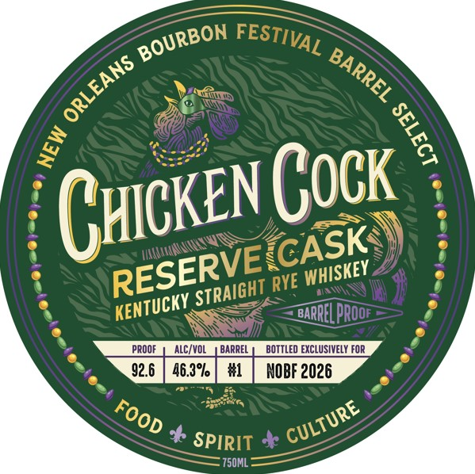

# TTB COLA Label Images - TTBID 26015001000477

**Brand Name:** CHICKEN COCK

**Issue Date:** 01/21/2026

**Origin Code:** 22

**Product Class/Type:** 102

**Source:** [TTB Public COLA Registry](https://ttbonline.gov/colasonline/viewColaDetails.do?action=publicFormDisplay&ttbid=26015001000477)

## Label Images

### Back Label

### Front Label

## Extracted Label Text

*Text extracted via OCR - may contain errors*

### Back Label

95, AY

we

CHICKE

N(0CK

WHISKEY

rm MALTED BARLEY

ha

rt

a

BARREL TYPE

aN

KELVIN CHAR #

NEW CHARRED AMERICAN WHITE OAK

WAREHOUSE LOCATION

IRE

RICKHOUSE D, ROW 23, LEVEL 2

OD SPIRI

ULTURE

CHAR TOAST:

DATE PULLED

#3 MEDIUM

4-22-2025

ST IN

PRODUCED BY

GOVERNMENT

WARNING

(I

ACCORDING TO THE SURGEON GENERAL

& BA

WOMEN SHOULD NOT DRINK ALCOHOLIC

P!IRIT

BEVERAGES

DURING

PREGNANCY

(WN, KEN

BECAUSE OF THE RISK OF BIRTH DEFECTS

(2

CONSUMPTION OF ALCOHOLIC

BEVERAGES IMPAIRS YOUR ABILITY TO

DRIVE A CAR OR OPERATE MACHINERY

MM

lL

|

Il

j

AND MAY CAUSE HEALTH PROBLEMS

10020

89052

MADE IN USA WWW.CHICKENCOCKWHISKEY.COM

L

### Front Label

gure0

i

7.)

<o

ay

CKEN GOCK

CH

ESER

HISKEY

Tucky STR

<P

PROOF | ALC/VOL BARREL | BOTTLED EXCLUSIVELY FOR

~f

cy .

2 & spy

0k

= 750ML
