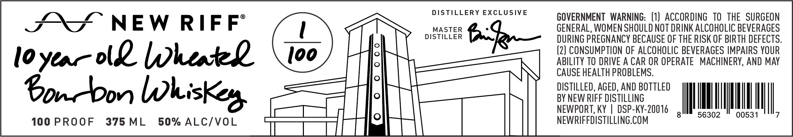

# TTB COLA Label Images - TTBID 26015001000504

**Brand Name:** NEW RIFF

**Issue Date:** 01/15/2026

**Origin Code:** 22

**Product Class/Type:** 141

**Source:** [TTB Public COLA Registry](https://ttbonline.gov/colasonline/viewColaDetails.do?action=publicFormDisplay&ttbid=26015001000504)

## Label Images

### Front Label

## Extracted Label Text

*Text extracted via OCR - may contain errors*

### Front Label

SS NEW RIFF’

10 yea AL heated

bono Whisker

100 PROOF 375ML 50% ALC/VOL

DISTILLERY EXCLUSIVE

MASTER
DISTILLER

GOVERNMENT WARNING: (1) ACCORDING TO THE SURGEON
GENERAL, WOMEN SHOULD NOT DRINK ALCOHOLIC BEVERAGES
DURING PREGNANCY BECAUSE OF THE RISK OF BIRTH DEFECTS.
(2) CONSUMPTION OF ALCOHOLIC BEVERAGES IMPAIRS YOUR
ABILITY TO DRIVE A CAR OR OPERATE MACHINERY, AND MAY

CAUSE HEALTH PROBLEMS.

DISTILLED, AGED, AND BOTTLED
BY NEW RIFF DISTILLING
NEWPORT, KY | DSP-KY-20016 IMM seco" ltoogsy ll,

NEWRIFFDISTILLING.COM :
