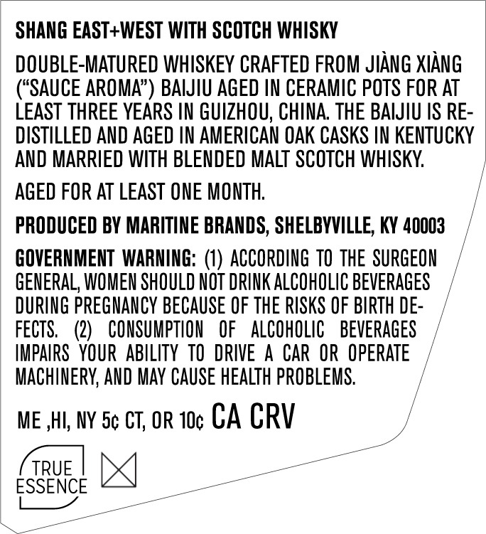
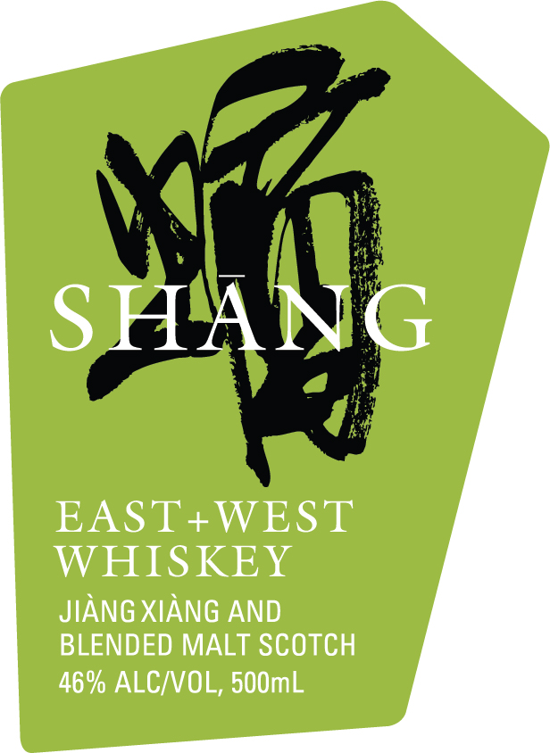

# TTB COLA Label Images - TTBID 26015001000571

**Brand Name:** SHANG

**Fanciful Name:** EAST + WEST SCOTCH 46

**Issue Date:** 01/15/2026

**Origin Code:** 22

**Product Class/Type:** 140

**Source:** [TTB Public COLA Registry](https://ttbonline.gov/colasonline/viewColaDetails.do?action=publicFormDisplay&ttbid=26015001000571)

## Label Images

### Back Label

### Front Label

### Label 3

## Extracted Label Text

*Text extracted via OCR - may contain errors*

*1 image(s) excluded: text did not meet readability threshold*

### Back Label

SHANG EAST+WEST WITH SCOTCH WHISKY

DOUBLE-MATURED WHISKEY CRAFTED FROM JIANG XIANG

(“SAUCE AROMA”) BAIJIU AGED IN CERAMIC POTS FOR AT

LEAST THREE YEARS IN GUIZHOU, CHINA. THE BAIJIU IS RE-

DISTILLED AND AGED IN AMERICAN OAK CASKS IN KENTUCKY

AND MARRIED WITH BLENDED MALT SCOTCH WHISKY.

AGED FOR AT LEAST ONE MONTH

PRODUCED BY MARITINE BRANDS, SHELBYVILLE, KY 40003

GOVERNMENT WARNING: (1) ACCORDING TO THE SURGEON

GENERAL, WOMEN SHOULD NOT DRINK ALCOHOLIC BEVERAGES

DURING PREGNANCY BECAUSE OF THE RISKS OF BIRTH DE

FECTS. (2) CONSUMPTION OF ALCOHOLIC BEVERAGES

IMPAIRS YOUR ABILITY TO DRIVE A CAR OR OPERATE

MACHINERY, AND MAY CAUSE HEALTH PROBLEMS.

ME HI, NY 5¢ CT, OR 10¢ CA CRV

ESSENCE x]

### Front Label

EAST+WEST
WHISKEY

JIANG XIANG AND
BLENDED MALT SCOTCH
46% ALC/VOL, 500mL
