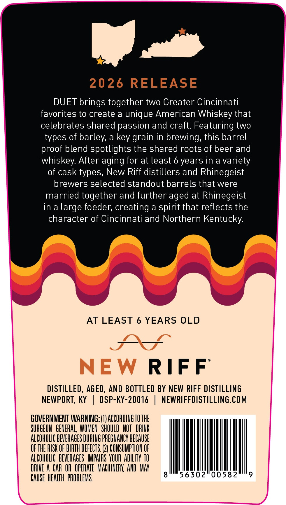
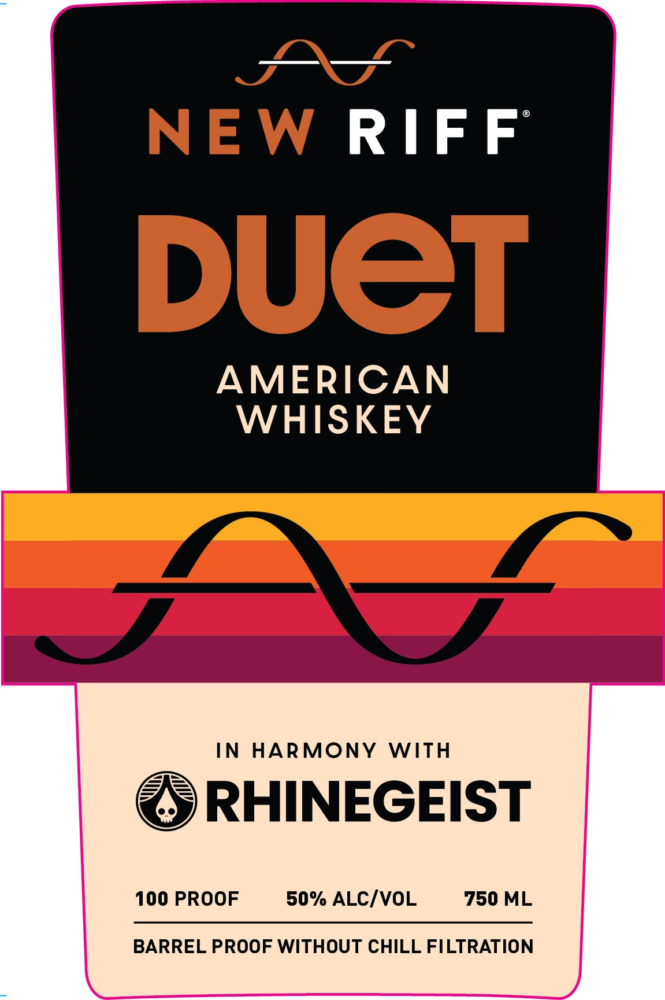
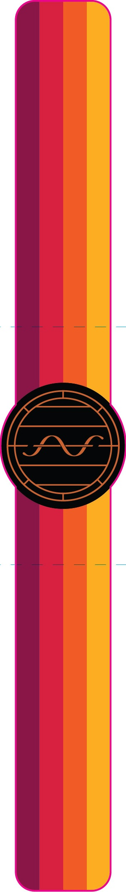

# TTB COLA Label Images - TTBID 26015001000581

**Brand Name:** NEW RIFF

**Issue Date:** 01/15/2026

**Origin Code:** 22

**Product Class/Type:** 140

**Source:** [TTB Public COLA Registry](https://ttbonline.gov/colasonline/viewColaDetails.do?action=publicFormDisplay&ttbid=26015001000581)

## Label Images

### Back Label

### Front Label

### Label 3

## Extracted Label Text

*Text extracted via OCR - may contain errors*

### Back Label

WP te

DUET brings together two Greater Cincinnat

favorites to create a unique American Whiskey that

celebrates shared passion and craft. Featuring two

types of barley, a key grain in brewing, this barrel

proof blend spotlights the shared roots of beer and

whiskey. After aging for at least 6 years in a variety

of cask types, New Riff distillers and Rhinegeist

brewers selected standout barrels that were

married together and further aged at Rhinegeist

in a large foeder, creating a spirit that reflects the

character of Cincinnati and Northern Kentucky.

AT LEAST 6 YEARS OLD

Sanwa

NEW RIFF

DISTILLED, AGED, AND BOTTLED BY NEW RIFF DISTILLING

NEWPORT, KY | DSP-KY-20016 | NEWRIFFDISTILLING.COM

GOVERNMENT WARNING: (1) ACCORDING 10 THE

SUAGEON GENERAL WOMEN SHOULD NOT DRINK

ALCOHOLIC BEVERAGES DURING PREGNANCY BECAUSE

OF THE RISK OF BIRTH DEFECTS. (2) CONSUMPTION OF

ALCOHOLIC BEVERAGES IMPAIRS YOUR ABILITY 10

DRIVE A CAR OR OPERATE MACHINERY, AND AMAY

MM

6302° 0058

CAUSE HEALTH PROBLEMS

——

### Front Label

——=

NEW RIFF

DUCT

AMERICAN

WHISKEY

IN HARMONY WITH

=r—

(=A

RHINEGEIST

100 PROOF

50% ALC/VOL

750 ML

BARREL PROOF WITHOUT CHILL FILTRATION
