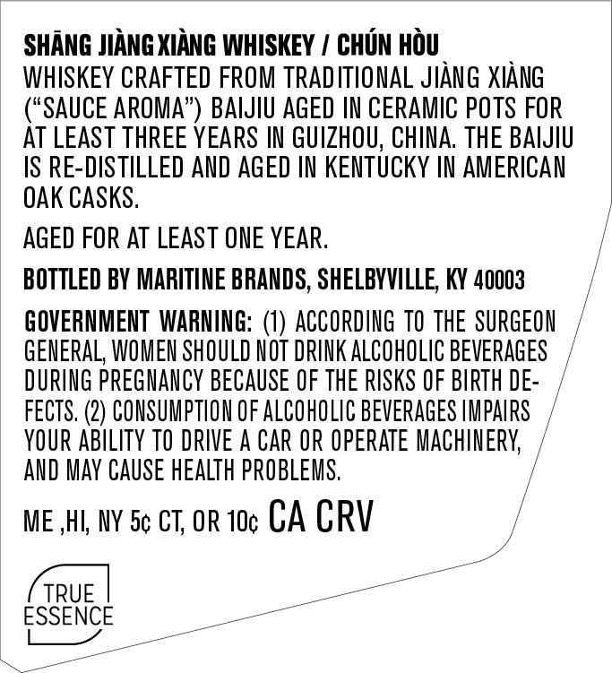
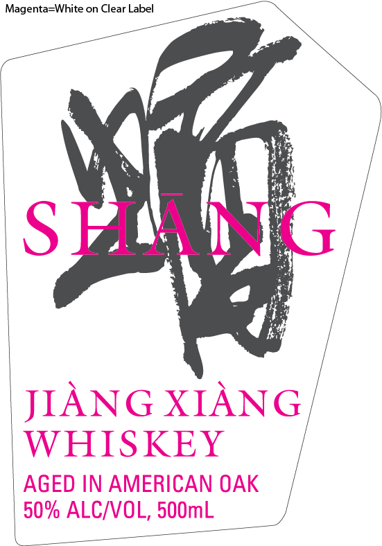

# TTB COLA Label Images - TTBID 26015001000583

**Brand Name:** SHANG

**Fanciful Name:** CHUN HOU

**Issue Date:** 01/28/2026

**Origin Code:** 22

**Product Class/Type:** 140

**Source:** [TTB Public COLA Registry](https://ttbonline.gov/colasonline/viewColaDetails.do?action=publicFormDisplay&ttbid=26015001000583)

## Label Images

### Back Label

### Front Label

### Label 3

## Extracted Label Text

*Text extracted via OCR - may contain errors*

*1 image(s) excluded: text did not meet readability threshold*

### Back Label

SHANG JIANG XIANG WHISKEY / CHUN HOU

WHISKEY CRAFTED FROM TRADITIONAL JIANG XIANG

(“SAUCE AROMA”) BAIJIU AGED IN CERAMIC POTS FOR

AT LEAST THREE YEARS IN GUIZHOU, CHINA. THE BAIJIU

IS RE-DISTILLED AND AGED IN KENTUCKY IN AMERICAN

OAK CASKS

AGED FOR AT LEAST ONE YEAR

BOTTLED BY MARITINE BRANDS, SHELBYVILLE, KY 40003

GOVERNMENT WARNING: (1) ACCORDING TO THE SURGEON

GENERAL, WOMEN SHOULD NOT DRINK ALCOHOLIC BEVERAGES

DURING PREGNANCY BECAUSE OF THE RISKS OF BIRTH DE

FECTS. (2) CONSUMPTION OF ALCOHOLIC BEVERAGES IMPAIRS

YOUR ABILITY TO DRIVE A CAR OR OPERATE MACHINERY,

AND MAY CAUSE HEALTH PROBLEMS.

/

ME HI, NY Se cT, oR 10¢ CA CRV

ESSENCE

### Front Label

4

ob

S TAN

(

fi

JIANG XIAN

WHISKEY

AGED IN AMERICAN OAK

°

—_

50% ALCIVOL, 500mL J

ee

__

=
