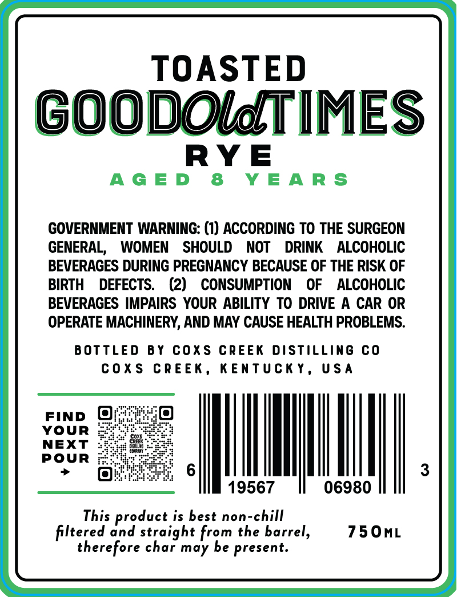
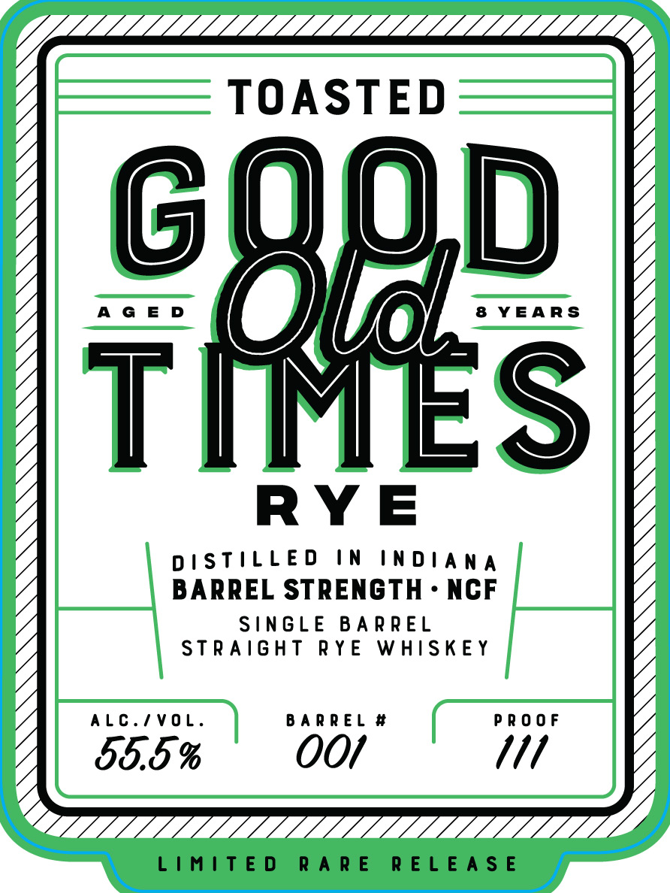

# TTB COLA Label Images - TTBID 26015001000636

**Brand Name:** GOOD OLD TIMES RYE

**Fanciful Name:** TOASTED

**Issue Date:** 01/15/2026

**Origin Code:** 22

**Product Class/Type:** 102

**Source:** [TTB Public COLA Registry](https://ttbonline.gov/colasonline/viewColaDetails.do?action=publicFormDisplay&ttbid=26015001000636)

## Label Images

### Back Label

### Front Label

## Extracted Label Text

*Text extracted via OCR - may contain errors*

### Back Label

TOASTED

D

O

Ta)

GOO

00

TIMES

RYE

AGED 8 YEARS

GOVERNMENT WARNING: (1) ACCORDING TO THE SURGEON

GENERAL, WOMEN SHOULD NOT DRINK ALCOHOLIC

BEVERAGES DURING PREGNANCY BECAUSE OF THE RISK OF

BIRTH DEFECTS. (2) CONSUMPTION OF ALCOHOLIC

BEVERAGES IMPAIRS YOUR ABILITY TO DRIVE A CAR OR

OPERATE MACHINERY, AND MAY CAUSE HEALTH PROBLEMS.

BOTTLED BY COXS CREEK DISTILLING CO

COXS CREEK, KENTUCKY, USA

xs

FIND

YOUR

NEXT

POUR

MN

J

19567

06980

This product is best non-chill

filtered and straight from the barrel,

750mL

therefore char may be present.

### Front Label

TG

TOASTED

0

UD

AGED

8&8 YEARS

\/

RYE

DISTILLED IN INDIANA

BARREL STRENGTH - NCF

STRAIGHT RYE WHISKEY

ALC./VOL.

55.5 %

OOf

Mm

“4

LIMITED RARE RELEASE
