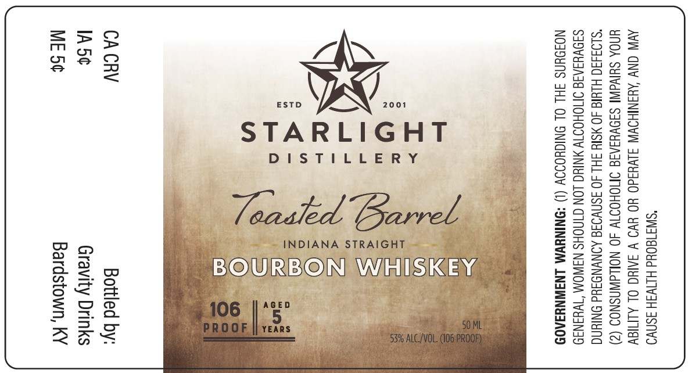

# TTB COLA Label Images - TTBID 26016001000322

**Brand Name:** STARLIGHT DISTILLERY

**Issue Date:** 01/16/2026

**Origin Code:** 22

**Product Class/Type:** 101

**Source:** [TTB Public COLA Registry](https://ttbonline.gov/colasonline/viewColaDetails.do?action=publicFormDisplay&ttbid=26016001000322)

## Label Images

### Label 1

## Extracted Label Text

*Text extracted via OCR - may contain errors*

### Label 1

"SWI180Ud HITWSH ASNVO
AVIN ONY ‘AYANIHOWW SLV¥3d0 YO Y¥O V SAIC OL ALMIGY
UNOA SHIVAINI SIOVYIAIG OMOHOTTW 40 NOLLdWASNOS (2)
“SLO3430 HLUIG 40 MSIY SH 40 SSNVOSE AONVNDAd ONIYNG
S39VYIAIG IMOHOTTW ANIUG LON GINOHS NAWOM “WHANS9
NOJOUNS JHL OL ONIGHOIOY (1) *ONINYWM LNAWNYIA0D

- y
mes = *
As? of:
)4 = 5
eB FE Zz
a a i
vn bs
CACRV Bottled by:
IA5¢ Gravity Drinks

Bardstown, KY
