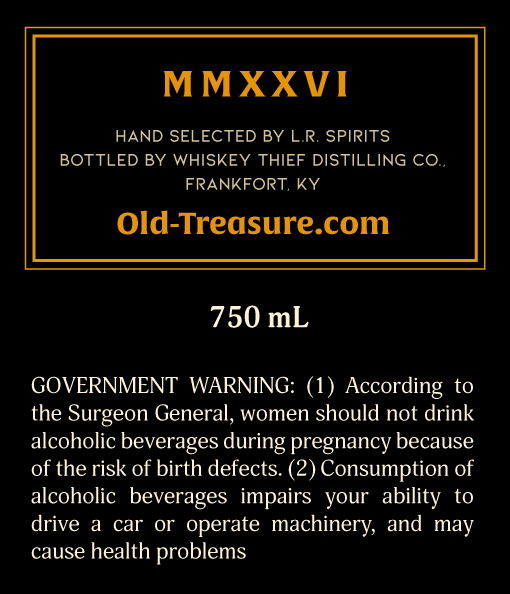
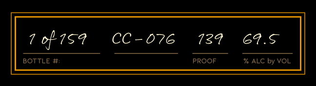

# TTB COLA Label Images - TTBID 26016001000345

**Brand Name:** OLD TREASURE

**Issue Date:** 01/16/2026

**Origin Code:** 22

**Product Class/Type:** 101

**Source:** [TTB Public COLA Registry](https://ttbonline.gov/colasonline/viewColaDetails.do?action=publicFormDisplay&ttbid=26016001000345)

## Label Images

### Back Label

### Front Label

### Label 2

## Extracted Label Text

*Text extracted via OCR - may contain errors*

### Back Label

MMXXVI

HAND SELECTED BY L.R. SPIRITS

BOTTLED BY WHISKEY THIEF DISTILLING CO.

FRANKFORT, KY

Old-Treasure.com

750 mL

GOVERNMENT WARNING: (1) According to

the Surgeon General, women should not drink

alcoholic beverages during pregnancy because

of the risk of birth defects. (2) Consumption of

alcoholic beverages impairs your ability to

drive a car or operate machinery, and may

cause health problems

### Front Label

CC-076

789 69.5

7 of 159

BOTTLE #.

PROOF

%h ALC by VOL

### Label 2

Yi,

&y

—

7

Zi

ED

ll

iz

ens

a

Ss
