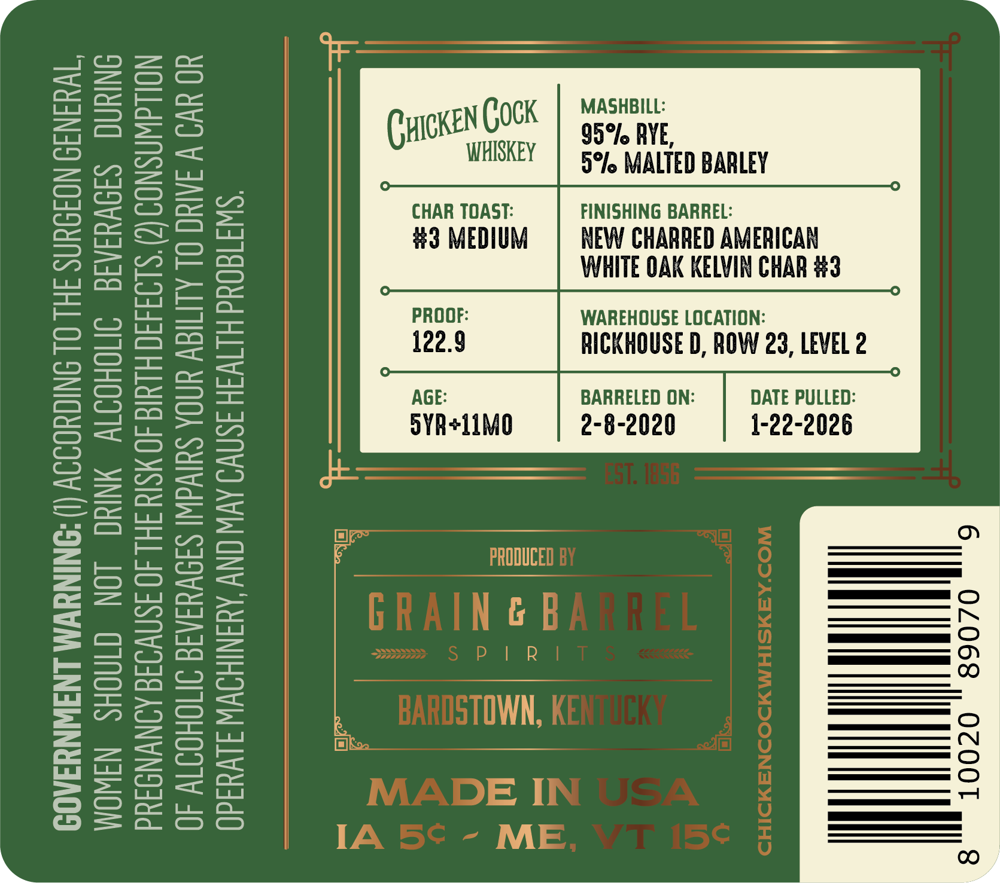
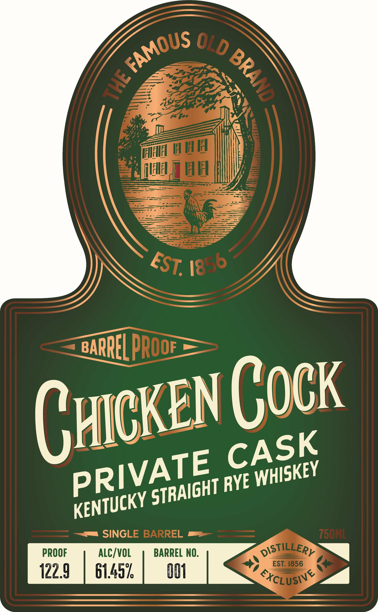
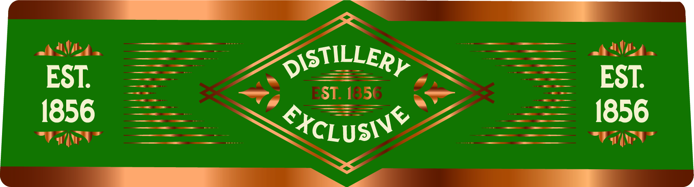

# TTB COLA Label Images - TTBID 26016001000407

**Brand Name:** CHICKEN COCK

**Fanciful Name:** PRIVATE CASK RYE

**Issue Date:** 01/23/2026

**Origin Code:** 22

**Product Class/Type:** 102

**Source:** [TTB Public COLA Registry](https://ttbonline.gov/colasonline/viewColaDetails.do?action=publicFormDisplay&ttbid=26016001000407)

## Label Images

### Back Label

### Front Label

### Label 2

## Extracted Label Text

*Text extracted via OCR - may contain errors*

*1 image(s) excluded: text did not meet readability threshold*

### Back Label

02068 , OCOOT

| !

DATE PULLED:
1-22-2026

-2020

RICKHOUSE D, ROW 23, LEVEL 2
8

WHITE OAK KELVIN CHAR #3

WAREHOUSE LOCATION:

ie
=
=
= oa
— =
| i=
— oes)

=| zo
| Soe
=| o=
= ==
= z=
e|

o | 2m
wm | oz

MASHBILL:
95° RYE,
BARRELED ON:
2-

CHAR TOAST:
#3 MEDIUM
ovR+11M0

AGE:

‘SWIT8OUd HLIVIH ISNWO AV ONY AYANIHOWW JLVu4d0
YO VO V IAC OL ALIMIAY UNDA SUIVWI SISVYIAIG INOHOITW 40
NOLLAWASNOD(2)’S199430 HLUIG 40 WSId FHL 40 ISNVIIE AINWNDTUd
ONIUAG SIOVYIAIE IJNOHOITY MNIYC LON CINOHS NaWOM
"TWUINI9 NOISUNS IHL OL SNIGHODIV (!) ‘SNINYWM LNIWNYIAOD

### Front Label

AicKEN (0CK

Param

GHT

PROOF

ALC/VOL

BARREL NO.

122.9

61457,

Ul
