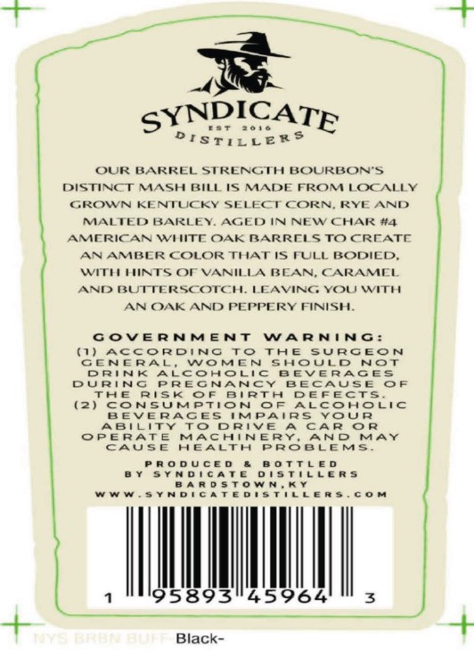
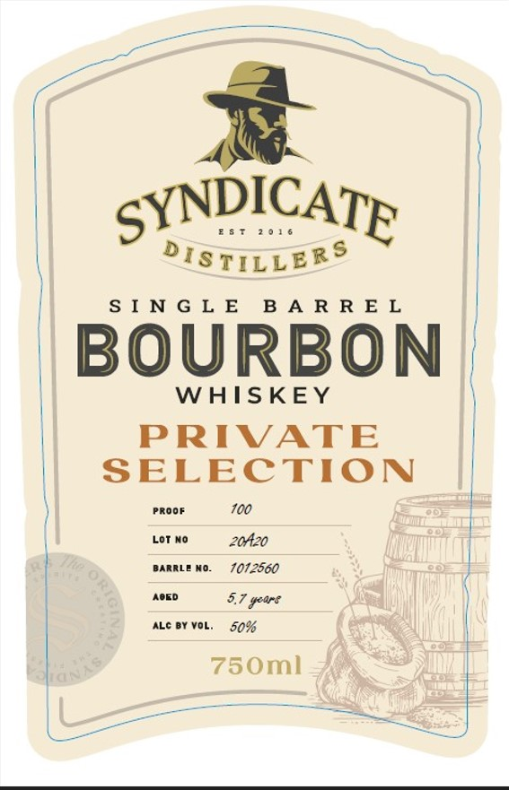
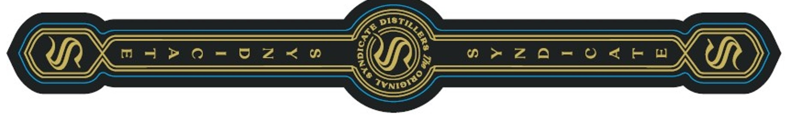

# TTB COLA Label Images - TTBID 26017001000026

**Brand Name:** SYNDICATE DISTILLERS

**Issue Date:** 01/20/2026

**Origin Code:** 22

**Product Class/Type:** 141

**Source:** [TTB Public COLA Registry](https://ttbonline.gov/colasonline/viewColaDetails.do?action=publicFormDisplay&ttbid=26017001000026)

## Label Images

### Back Label

### Front Label

### Label 3

## Extracted Label Text

*Text extracted via OCR - may contain errors*

*1 image(s) excluded: text did not meet readability threshold*

### Back Label

=

yYNDICA

ar

parry

ined

OUR BARREL STRENGTH BOURBON’S,

DISTINCT MASH BILL IS MADE FROM LOCALLY

GROWN KENTUCKY SELEG

CT CORN, RYE AND.

MALTED BARLEY. AGED IN NEW CHAR #4

AMERICAN Wt

ITE OAK BARRELS TO CREATE

AN AMBER COLOR THAT IS FULL BODIED,

ITE

INTS OF VANILLA BEAN, CARAMEL

AND BUTTERSCOTCH. LEAVING YOU WITH

AN OAK AND PEPPERY FINISH.

GOVERNMENT WARNING:

0) ACCORDING TO THE SURGEON

GENERAL, WOMEN SHOULD NOT

DRINK ALCOHOLIC BEVERAGES

DURING PREGNANCY BECAUSE OF

THE RISK OF BIRTH DEFECTS

(2) CONSUMPTION OF ALCOHOLIC

BEVERAGES

IMPAIRS YOUR

ABILITY TO DRIVE A CAR OR

OPERATE MACHINERY, AND MAY

CAUSE HEALTH PROBLEMS.

PRODUCED & BOTTLED

BY SYNDICATE OISTILLERS

BARDSTOWN,KY

WWWw.SYNDICATEDISTILLERS.COM

LWT

-

Black-

### Front Label

gyYNDICA :

Oates |
SINGLE BARREL
BOURBON
WHISKEY

PRIVATE
SELECTION

PROOF 100

borne 20420
parnLe no. 1072560

‘AoED 5.7 youre
ALE BY VOL. 50%

750ml
