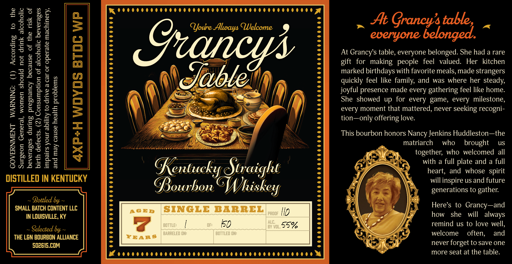

# TTB COLA Label Images - TTBID 26018001000025

**Brand Name:** GRANCY'S TABLE

**Issue Date:** 01/21/2026

**Origin Code:** 22

**Product Class/Type:** 101

**Source:** [TTB Public COLA Registry](https://ttbonline.gov/colasonline/viewColaDetails.do?action=publicFormDisplay&ttbid=26018001000025)

## Label Images

### Back Label

## Extracted Label Text

*Text extracted via OCR - may contain errors*

### Back Label

Do

oe

wee

on

At Grancy’s table, everyone belonged. She had a rare

aan

gift for making people feel valued. Her kitchen

(0)

marked birthdays with favorite meals, made strangers

(

IG

quickly feel like family, and was where her steady,

joyful presence made every gathering feel like home.

beg

(Wy)

She showed up for every game, every milestone,

ao

every moment that mattered, never seeking recogni-

po

Uy

tion—only offering love.

This bourbon honors Nancy Jenkins Huddleston—the

gf

Le

S

matriarch = who

us

su

oo

aS

ithibelld

Ms

"A

vac

hi

r.

brought

pos

=

together, who welcomed all

Ls

Wea

@

>),

>)

Co,

Onn da

ES

8

with a full plate and a full

Re

en

iC.

VOU

£

heart, and whose spirit

Ay

ai

will inspire us and future

DISTILLED IN KENTUCKY

= |

[ij +

4S

hon

generations to gather.

- Bottled by ~

SMALL BATCH CONTENT LLC

ae

Here’s to Grancy—and

Ul

fh

0

i»

IN LOUISVILLE, KY

how she will always

{

ie)

55%,

[fs

remind us to love well,

- Selected by ~

welcome often,

and

THE LEN BOURBON ALLIANCE

ayer

Ay

S02615.COM

NS

never forget to save one

Lovreorees

ooe

ooee

e

Coeeeeeooonre

oo

more seat at the table.

pee
