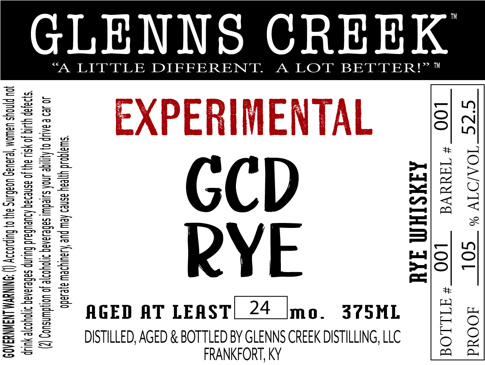

# TTB COLA Label Images - TTBID 26019001000313

**Brand Name:** GLENNS CREEK

**Fanciful Name:** EXPERIMENTAL GCD RYE

**Issue Date:** 01/21/2026

**Origin Code:** 22

**Product Class/Type:** 142

**Source:** [TTB Public COLA Registry](https://ttbonline.gov/colasonline/viewColaDetails.do?action=publicFormDisplay&ttbid=26019001000313)

## Label Images

### Label 1

## Extracted Label Text

*Text extracted via OCR - may contain errors*

### Label 1

GLENNS CREEK

“A LITTLE DIFFERENT. A LOT BETTER!”

GCD

&

P='O

Fl |

RYE

AGED AT LEAST

24

mo.

375ML

a

DISTILLED, AGED & BOTTLED BY GLENNS CREEK DISTILLING, LLC

FRANKFORT, KY
