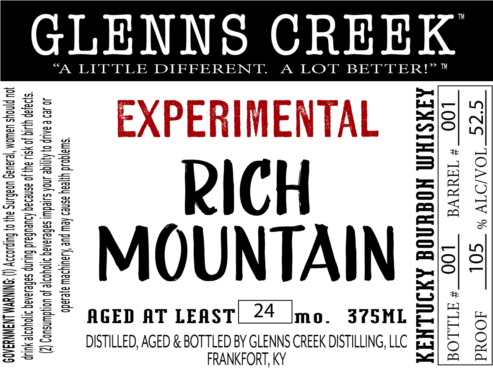

# TTB COLA Label Images - TTBID 26019001000318

**Brand Name:** GLENNS CREEK

**Fanciful Name:** EXPERIMENTAL RICH MOUNTAIN

**Issue Date:** 01/22/2026

**Origin Code:** 22

**Product Class/Type:** 141

**Source:** [TTB Public COLA Registry](https://ttbonline.gov/colasonline/viewColaDetails.do?action=publicFormDisplay&ttbid=26019001000318)

## Label Images

### Label 1

## Extracted Label Text

*Text extracted via OCR - may contain errors*

### Label 1

GLENNS CREEK

“A LITTLE DIFFERENT. A LOT BETTER!”

Fated | —

He)

”\O

RICH

&

MOUNTAIN

AGED AT LEAST|_24 [mo. 375ML

a

DISTILLED, AGED & BOTTLED BY GLENNS CREEK DISTILLING, LLC acy

FRANKFORT, KY
