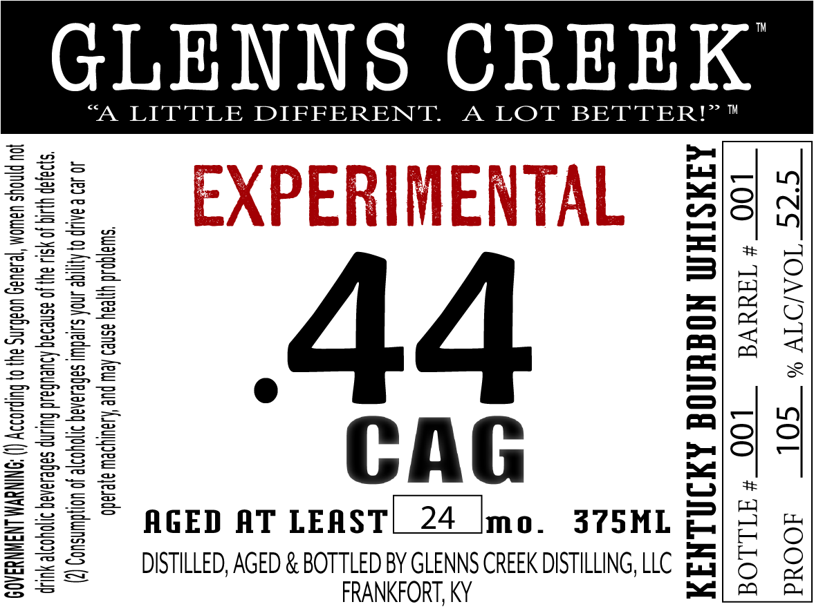

# TTB COLA Label Images - TTBID 26019001000326

**Brand Name:** GLENNS CREEK

**Fanciful Name:** EXPERIMENTAL .44 CAG

**Issue Date:** 01/21/2026

**Origin Code:** 22

**Product Class/Type:** 141

**Source:** [TTB Public COLA Registry](https://ttbonline.gov/colasonline/viewColaDetails.do?action=publicFormDisplay&ttbid=26019001000326)

## Label Images

### Label 1

## Extracted Label Text

*Text extracted via OCR - may contain errors*

### Label 1

GLENNS CREEK

A LITTLE DIFFERENT. A LOT BETTER!

&

44

CAG

AGED AT LEAST

mo.

375ML

DISTILLED, AGED & BOTTLED BY GLENNS CREEK DISTILLING, LLC

ae

FRANKFORT, KY
