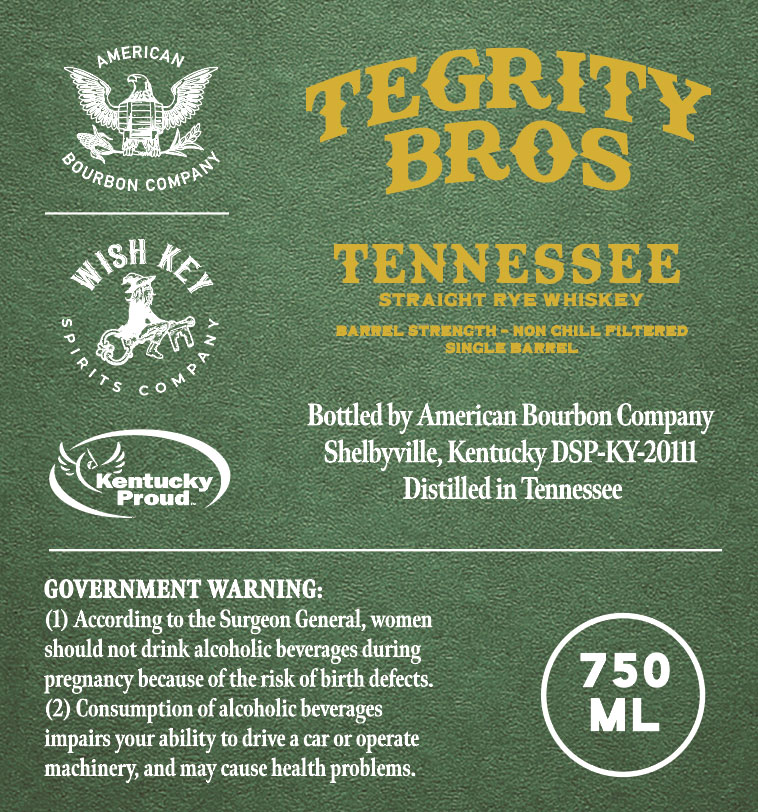
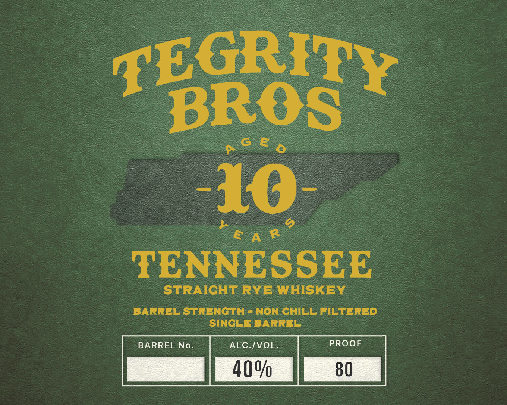

# TTB COLA Label Images - TTBID 26020001000139

**Brand Name:** TEGRITY BROS

**Issue Date:** 02/12/2026

**Origin Code:** 43

**Product Class/Type:** 102

**Source:** [TTB Public COLA Registry](https://ttbonline.gov/colasonline/viewColaDetails.do?action=publicFormDisplay&ttbid=26020001000139)

## Label Images

### Back Label

### Front Label

## Extracted Label Text

*Text extracted via OCR - may contain errors*

### Back Label

siee Vy

ym

£

GRIT

i

¥

“Reon come

—~#B

ROS

_PENNESSEE

ot Ke

STRAIGHT. RYE WHISKEY.

a

>

3

2

=

BARWEL STRENGTH NON CHILE FILTERED

SINGLE BARREL

a

v

ae cot

Bottled by American Bourbon Company

Shelbyville, Kentucky DSP-KY-20111

nt

ucky.

Distilled in Tennessee

Cs

Proud.

GOVERNMENT WARNING

(1) According to the Surgeon General, women

should not drink alcoholic beverages during

pregnancy because of the risk of birth defects.

(2) Consumption of alcoholic beverages

impairs your ability to drive a car or operate

machinery, and may cause health problems.

### Front Label

TENN SSEE

STRAIGHT. RYE. WHISKEY

BARREL STRENGTH - NON CHILL FILTERED

SINGLE BARREL

ALC./VOL
