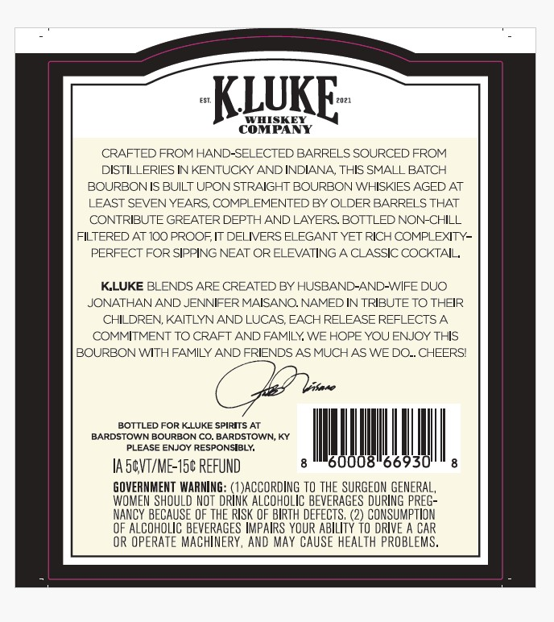
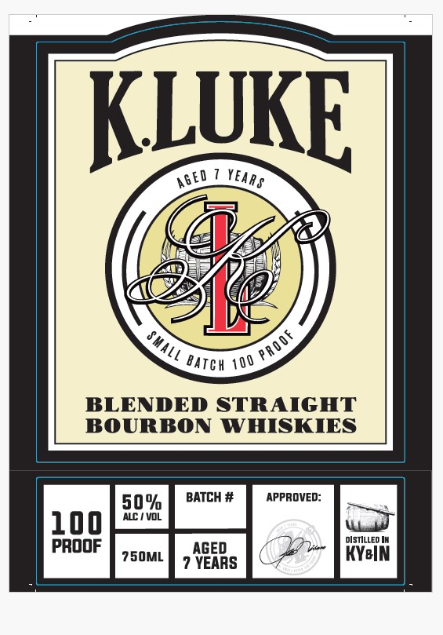
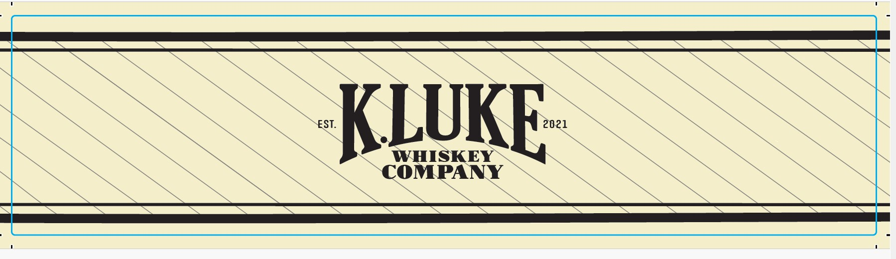

# TTB COLA Label Images - TTBID 26020001000146

**Brand Name:** K.LUKE

**Issue Date:** 01/23/2026

**Origin Code:** 22

**Product Class/Type:** 121

**Source:** [TTB Public COLA Registry](https://ttbonline.gov/colasonline/viewColaDetails.do?action=publicFormDisplay&ttbid=26020001000146)

## Label Images

### Back Label

### Front Label

### Label 3

## Extracted Label Text

*Text extracted via OCR - may contain errors*

### Back Label

-—— .KLUKF-

est

KLUKE-

CRAFTED FROM HAND-SI

D BARRELS SOURCED FROM

DISTILLERIES IN KENTUCKY AND INDIANA, THIS SMALL BATCH

BOURBON IS BUILT UPON STRAIGHT BOURBON WHISKIES AGED AT

Le

‘VEN YEA‘

EMENTED BY OLDER BARRELS THAT

CONTRIBUTE GRE,

PTH AND LAYERS. BOTTLED NON-CHILL

FILTERED AT 100 PROX

DELIVERS ELEGANT YET RICH COMPLEXITY-

PERFECT FOR SIPPIN

IEAT OR ELEVATING A CLASSIC COCKTAIL,

K.LUKE BLENDS ARE CREATED BY HUSBAND-AND-WIFE DUO

JONATHAN AND JENNIFER MAISANO. NAMED IN TRIBUTE TO THEIR

CHILDREN, KAITLYN AND LUCAS, EACH RELEASE REFLECTS A

COMMITMENT TO CRAFT AND FAMILY, WE HOPE YOU ENJOY THIS

BOURBON WITH FAMILY AND FRIENDS AS MUCH AS WE DO... CHEERS!

-

BOTTLED FOR KLLUKE SPIRITS AT

BARDSTOWN BOURBON CO. BARDSTOWN, KY

PLEASE ENJOY RESPONSIBLY,

Il

|

IASVT/ME-15¢ REFUND

8

6

ll

GOVERNMENT WARNING: (1)ACCORDING TO THE SURGEON GENERAL,

WOMEN SHOULD NOT DRINK ALCOHOLIC BEVERAGES DURING PREG-

NANCY BECAUSE OF THE RISK OF BIRTH DEFECTS. (2) CONSUMPTION

OF ALCOHOLIC BEVERAGES IMPAIRS YOUR ABILITY TO DRIVE A CAR

OR OPERATE MACHINERY, AND MAY CAUSE HEALTH PROBLEMS.

### Front Label

=

LUKE

yet tedpy

(A

Ley

t

V

ae

<r Patou 100 gS

BLENDED STRAIGHT

BOURBON WHISKIES

APPROVED:

DISTILLED In

8

PROOF rsom | ABs KG

fr

### Label 3

lila aE En ES

—

202 1

Nest

~

WHISKEY™~

SS

OMPANY

\
