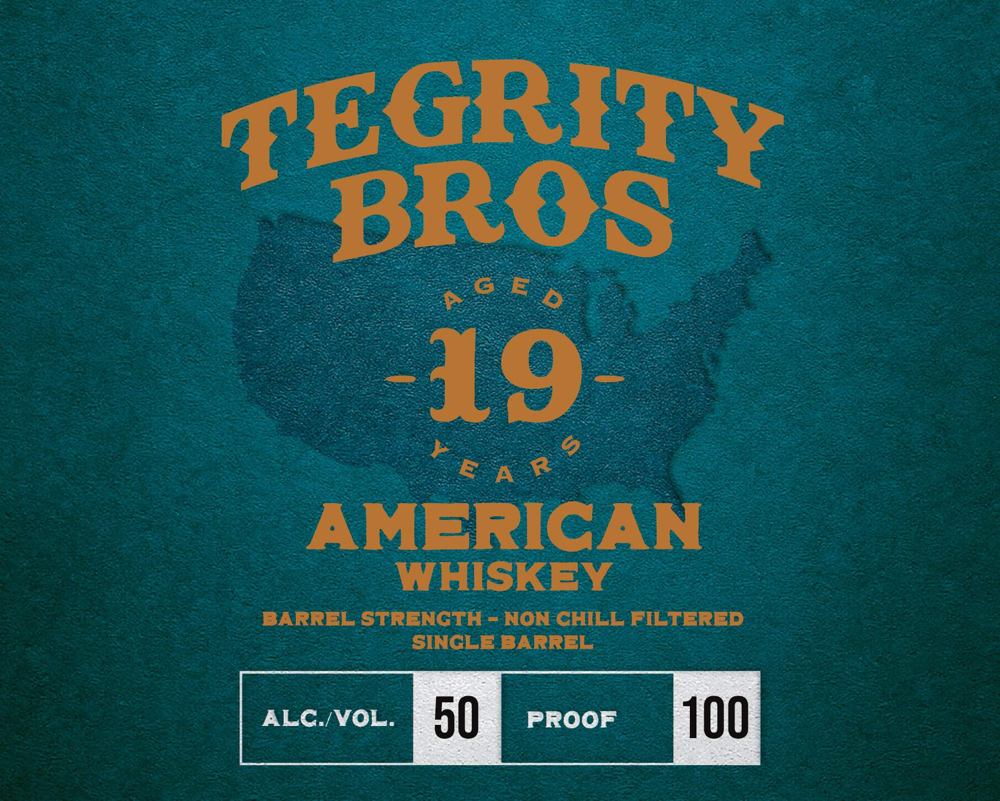
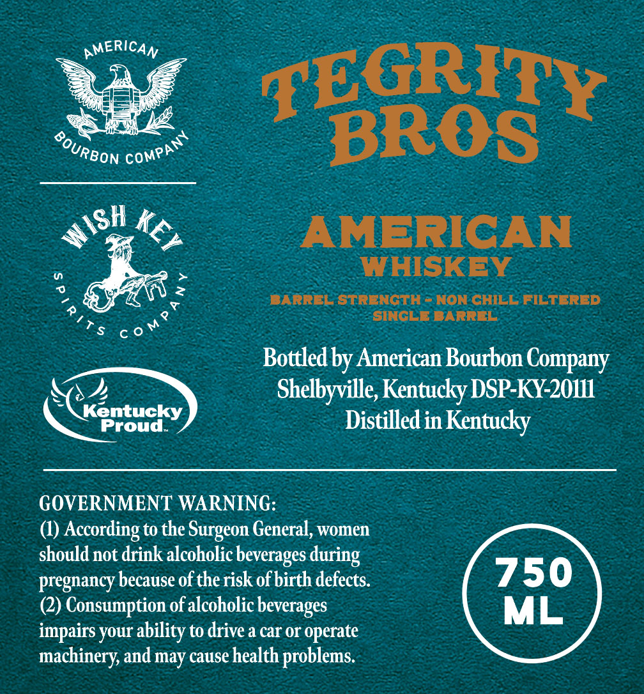

# TTB COLA Label Images - TTBID 26020001000148

**Brand Name:** TEGRITY BROS

**Issue Date:** 01/23/2026

**Origin Code:** 22

**Product Class/Type:** 140

**Source:** [TTB Public COLA Registry](https://ttbonline.gov/colasonline/viewColaDetails.do?action=publicFormDisplay&ttbid=26020001000148)

## Label Images

### Front Label

### Label 2

## Extracted Label Text

*Text extracted via OCR - may contain errors*

### Front Label

Lm

=

Ra

.

a:

Poe

face

Seek

Sa

ris

ee

ae

aN

S

rons

aes

a

a

2A

=

Ee

ae

ee

sere

EDS

feos

a

Bass

ie

ae

oe

ae

ie

a

as

aS

re

eran

oo:

Sine

wet

ns}

=

SS

ae

ones

a

ay

———

pen

4

a

ex

ie

cae

be;

SS

Ses

g

=

1a

eee

a

b<

Se

 &

—

Rees

tape

Pe

§

=.

&

>

ap

vs

SS

oa

Sis

=

a

ss

+83

wr

cote

Sos

en

sod

=

J

ae

os

Ss

ss

>»

rae

>

Ss

ae

te

3

ae

Sots

oy

a

a

=

ne

a

4

os

J

=

if

ca

‘Peeps

Na:

a

a

sore

@

Ld

oa

ee

oases

a

NN

en

wa,

S&

pea F i

ee

=

a

ee

ah

Soe

ae

max

wz

G

See

Ye

S5

BS

Se

<=

a

=

oa

oy

SS

IS

é

&

&

os

as

aS

os

SS

a0

Be

a

line

ta,

<4

S

re

=

ES

=

—

&

“S,

a

Se

=

a

a

SSE

ond

=

Se

. G

Ww

K

See

Hr

RR

EL STRENG

NON-CHII

L FI

ERED

=P

SINGL

ARREL

=

ALC./VOL.

PROOF

00

100

### Label 2

pMERIC4y,

om

EGRIT

¥Y

?

CR son cour

BROS

wy 'e.

AMERICAN

WHISKEY

BARREL STRENGTH = NON CHILL FILTERED

“rs cov

SINGLE BARREL

Bottled by American Bourbon Company

Shelbyville, Kentucky DSP-KY-2011

~“\ Kentucky

roud.

Distilled in Kentucky

GOVERNMENT WARNING:

(1) According to the Surgeon General, women

should not drink alcoholic beverages during

pregnancy because of the risk of birth defects.

(2) Consumption of alcoholic beverages

impairs your ability to drive a car or operate

machinery, and may cause health problems.
