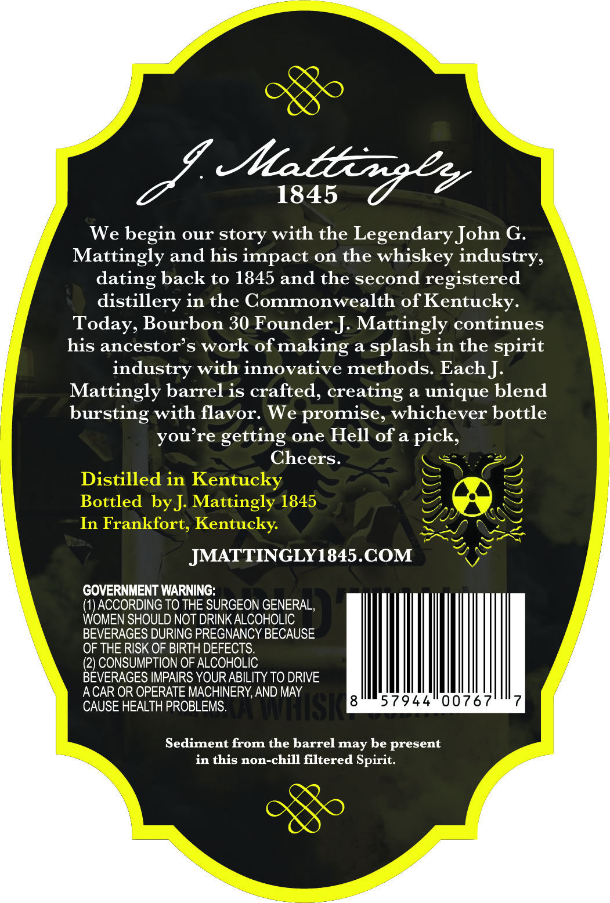
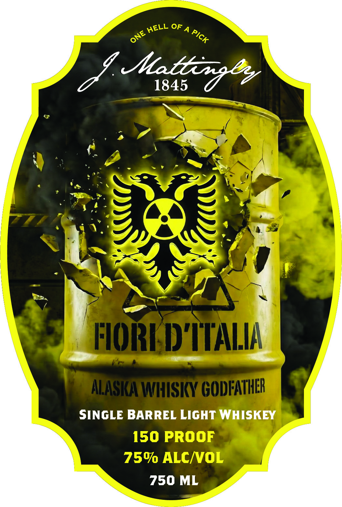

# TTB COLA Label Images - TTBID 26020001000151

**Brand Name:** J. MATTINGLY 1845

**Fanciful Name:** FIORI D'ITALIA

**Issue Date:** 01/23/2026

**Origin Code:** 22

**Product Class/Type:** 144

**Source:** [TTB Public COLA Registry](https://ttbonline.gov/colasonline/viewColaDetails.do?action=publicFormDisplay&ttbid=26020001000151)

## Label Images

### Back Label

### Label 1

### Label 3

