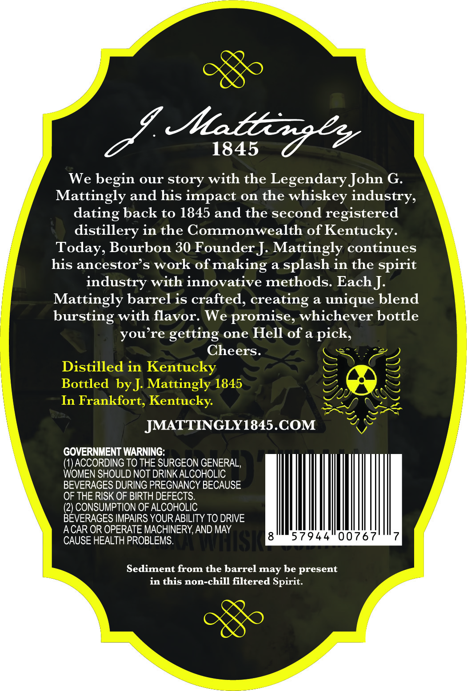
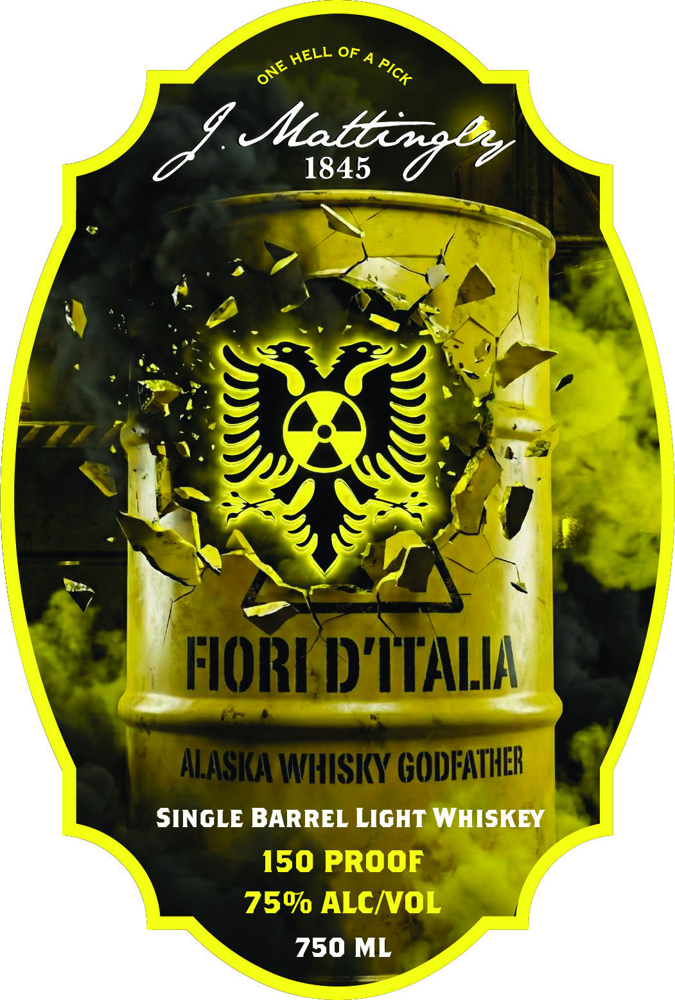

# TTB COLA Label Images - TTBID 26020001000151

**Brand Name:** J. MATTINGLY 1845

**Fanciful Name:** FIORI D'ITALIA

**Issue Date:** 01/23/2026

**Origin Code:** 22

**Product Class/Type:** 144

**Source:** [TTB Public COLA Registry](https://ttbonline.gov/colasonline/viewColaDetails.do?action=publicFormDisplay&ttbid=26020001000151)

## Label Images

### Back Label

### Label 1

### Label 3

## Extracted Label Text

*Text extracted via OCR - may contain errors*

### Back Label

A Cok os

We begin our story with the Legendary John G.

Mattingly and his impact on the whiskey industry,

dating back to 1845 and the second registered

distillery in the Commonwealth of Kentucky.

Today, Bourbon 30 Founder J. Mattingly continues

his ancestor’s work of making a splash in the spirit

industry with innovative methods. Each J.

Mattingly barrel is crafted, creating a unique blend

bursting with flavor. We promise, whichever bottle

you’re getting one Hell of a pick,

Cheers.

JMATTINGLY1845.COM

GOVERNMENT WARNING:

WOMEN SHOULD NOT DRINK ALCOHOLIC

(1) ACCORDING TO THE SURGEON GENERAL,

BEVERAGES DURING PREGNANCY BECAUSE

OF THE RISK OF BIRTH DEFECTS.

(2) CONSUMPTION OF ALCOHOLIC

BEVERAGES IMPAIRS YOUR ABILITY TO DRIVE

ACAR OR OPERATE MACHINERY, AND MAY

57944 00767

CAUSE HEALTH PROBLEMS.

Sediment from the barrel may be present

in this non-chill filtered Spirit.

### Label 1

{

“<e

AR

Lal

oa

SINGLE BARREL LIGHT WHISKEY

750 ML

### Label 3

~

J. MATTINGLY 1845

(Q
