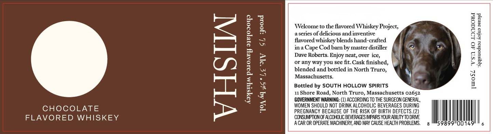

# TTB COLA Label Images - TTBID 26020001000166

**Brand Name:** MISHA

**Issue Date:** 03/06/2026

**Origin Code:** 26

**Product Class/Type:** 149

**Source:** [TTB Public COLA Registry](https://ttbonline.gov/colasonline/viewColaDetails.do?action=publicFormDisplay&ttbid=26020001000166)

## Label Images

### Label 1

## Extracted Label Text

*Text extracted via OCR - may contain errors*

### Label 1

Welcome to the flavored Whiskey Project,
aseries of delicious and inventive

flavored whiskey blends hand-crafted

ina Cape Cod barn by master distiller
Dave Roberts. Enjoy neat, over ice,

or any way you see fit. Cask finished,
blended and bottled in North Truro,
Massachusetts,

Bottled by SOUTH HOLLOW SPIRITS

11 Shore Road, North Truro, Massachusetts 02652
GOVERNMENT WARNING: (1) ACCORDING TO THE SURGEON GENERAL, |

[woSZ ‘v's dO Londoud

TAG 4G *LE AV SL yoord

WOMEN SHOULD NOT DRINK ALCOHOLIC BEVERAGES DURING

CHOCOLATE
FLAVORED WHISKEY

Aaysryas paxoavy a3eJoOI0Y9

PREGNANCY BECAUSE OF THE RISK OF BIRTH DEFECTS.(2)
‘BEVERAGES IMPAIRS YOUR ABILITY

CONSUMPTION OF ALCOHOLIC TO DRIVE
ACAR OR OPERATE MACHINERY, AND MAY CAUSE HEALTH PROBLEMS.

z
Wo
