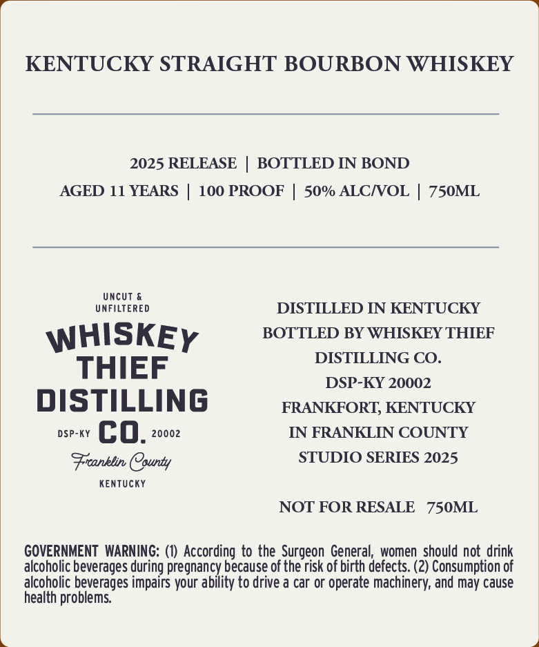
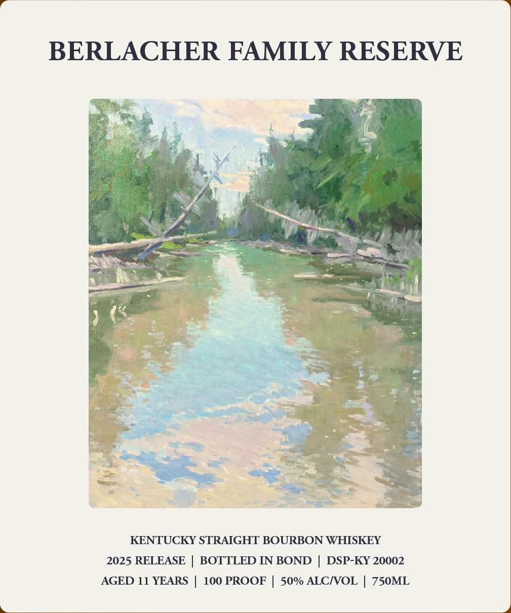

# TTB COLA Label Images - TTBID 26020001000345

**Brand Name:** WHISKEY THIEF DISTILLING CO.

**Fanciful Name:** BERLACHER FAMILY RESERVE

**Issue Date:** 01/21/2026

**Origin Code:** 22

**Product Class/Type:** 119

**Source:** [TTB Public COLA Registry](https://ttbonline.gov/colasonline/viewColaDetails.do?action=publicFormDisplay&ttbid=26020001000345)

## Label Images

### Back Label

### Front Label

## Extracted Label Text

*Text extracted via OCR - may contain errors*

### Back Label

KENTUCKY STRAIGHT BOURBON WHISKEY

2025 RELEASE | BOTTLED IN BOND

AGED 11 YEARS | 100 PROOF | 50% ALC/VOL | 750ML

UNFILTERED

UNCUT &

DISTILLED IN KENTUCKY

BOTTLED BY WHISKEY THIEF

WHISKEy

DISTILLING CO.

THIEF

DSP-KY 20002

DISTILLING

FRANKFORT, KENTUCKY

DSP-kY Co. 20002

IN FRANKLIN COUNTY

Franklin County

STUDIO SERIES 2025

KENTUCKY

NOT FOR RESALE 750ML

GOVERNMENT WARNING: (1) According to the Surgeon General, women should not drink

alcoholic beverages during pregnancy because of the risk of birth defects. (2) Consumption of

alcoholic beverages impairs your ability to drive a car or operate machinery, and may cause

health problems.

### Front Label

BERLACHER FAMILY RESERVE

KENTUCKY STRAIGHT BOURBON WHISKEY
2025 RELEASE | BOTTLED IN BOND | DSP-KY 20002
AGED 11 YEARS | 100 PROOF | 50% ALC/VOL | 750ML
