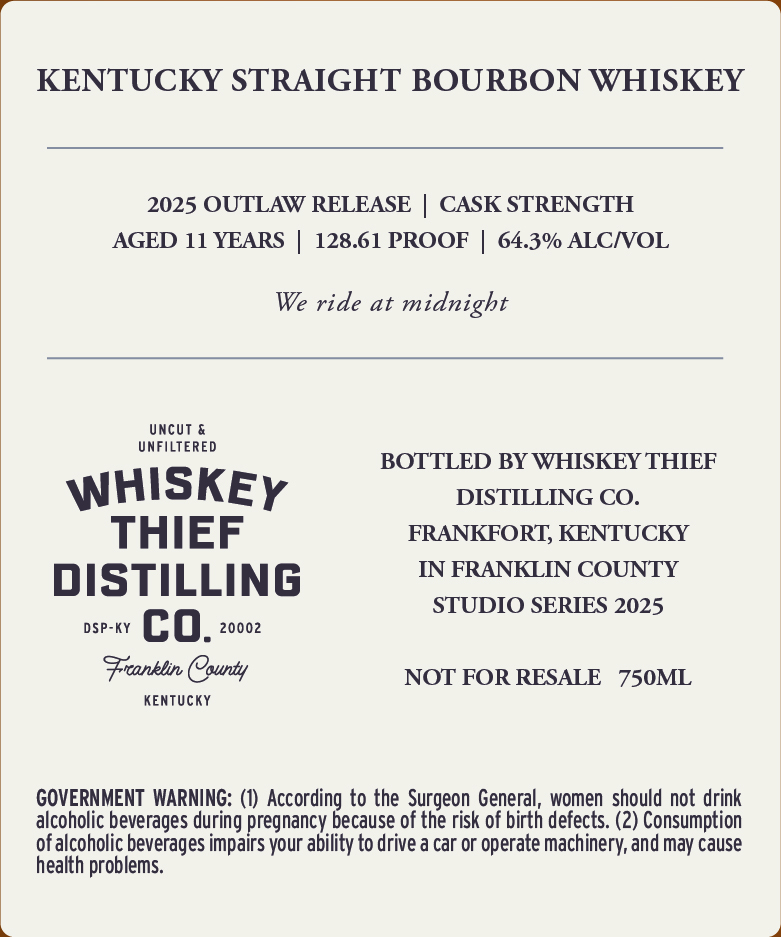
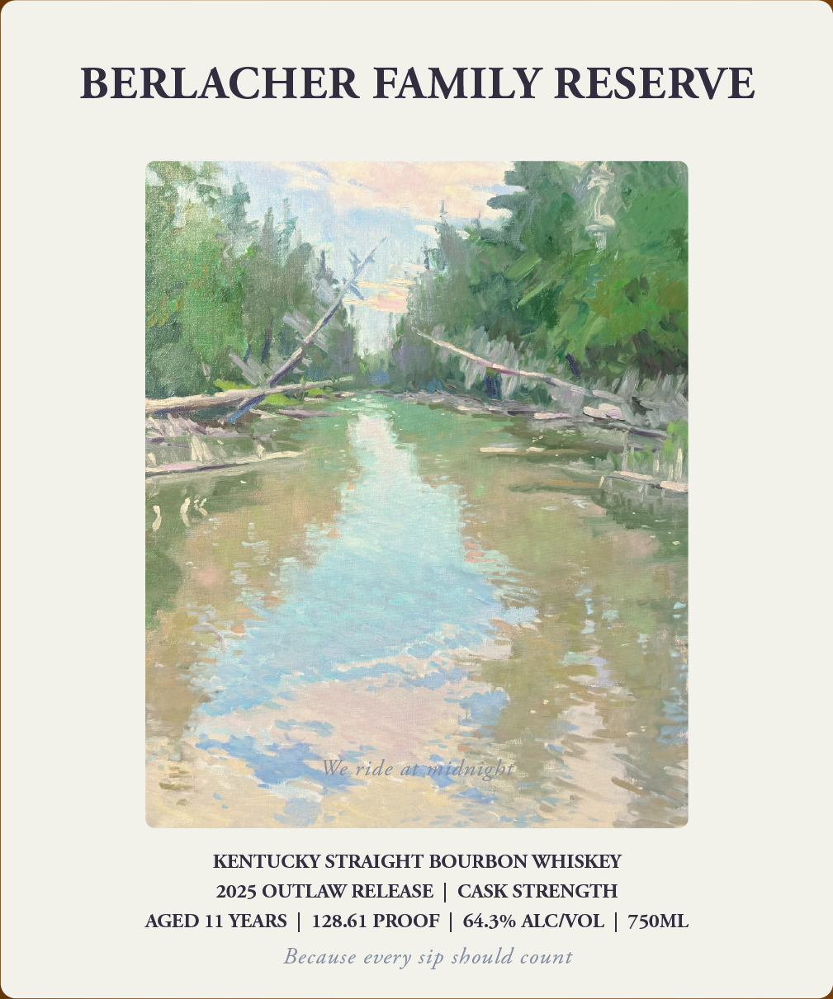

# TTB COLA Label Images - TTBID 26020001000347

**Brand Name:** WHISKEY THIEF DISTILLING CO.

**Fanciful Name:** BERLACHER FAMILY RESERVE

**Issue Date:** 01/22/2026

**Origin Code:** 22

**Product Class/Type:** 101

**Source:** [TTB Public COLA Registry](https://ttbonline.gov/colasonline/viewColaDetails.do?action=publicFormDisplay&ttbid=26020001000347)

## Label Images

### Back Label

### Front Label

## Extracted Label Text

*Text extracted via OCR - may contain errors*

### Back Label

KENTUCKY STRAIGHT BOURBON WHISKEY

2025 OUTLAW RELEASE | CASK STRENGTH

AGED 11 YEARS | 128.61 PROOF | 64.3% ALC/VOL

We ride at midnight

UNFILTERED

UNCUT &

BOTTLED BY WHISKEY THIEF

WHISKEy

DISTILLING CO.

THIEF

FRANKFORT, KENTUCKY

IN FRANKLIN COUNTY

DISTILLING

STUDIO SERIES 2025

DSP-kY C 0. 20002

Franklin County

KENTUCKY

NOT FOR RESALE 750ML

GOVERNMENT WARNING: (1) According to the Surgeon General, women should not drink

alcoholic beverages during pregnancy because of the risk of birth defects. (2) Consumption

of alcoholic beverages impairs your ability to drive a car or operate machinery, and may cause

health problems.

### Front Label

BERLACHER FAMILY RESERVE

=

(

—

— 7

1

io

&

—a

We ride cadenp

ws

“Seat

ee

KENTUCKY STRAIGHT BOURBON WHISKEY

2025 OUTLAW RELEASE | CASK STRENGTH

AGED 11 YEARS | 128.61 PROOF | 64.3% ALC/VOL | 750ML

Because every sip should count
