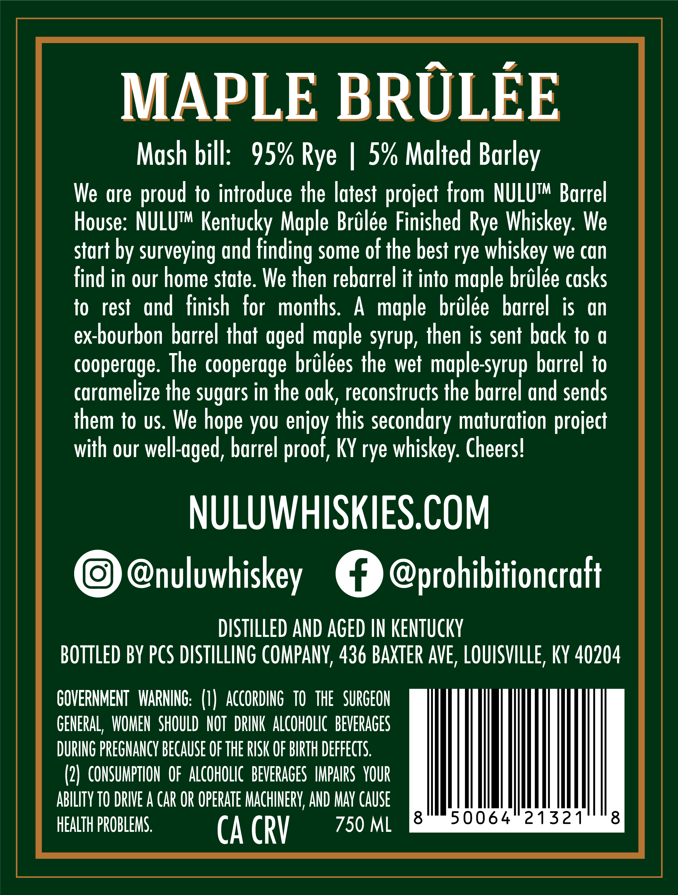
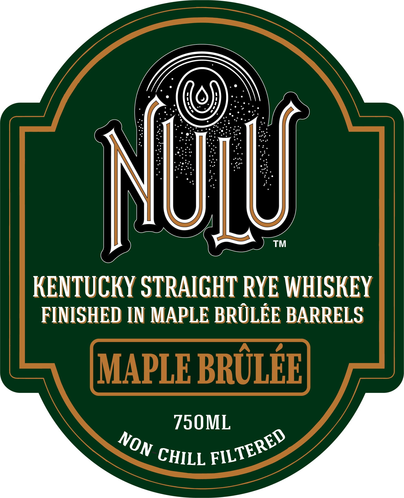
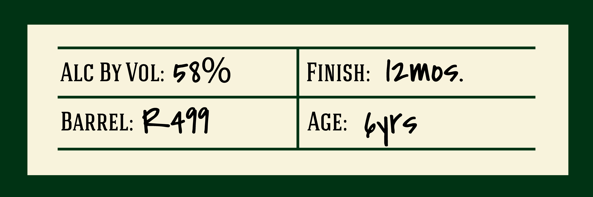

# TTB COLA Label Images - TTBID 26020001000876

**Brand Name:** NULU

**Fanciful Name:** MAPLE BRULEE

**Issue Date:** 01/22/2026

**Origin Code:** 22

**Product Class/Type:** 102

**Source:** [TTB Public COLA Registry](https://ttbonline.gov/colasonline/viewColaDetails.do?action=publicFormDisplay&ttbid=26020001000876)

## Label Images

### Back Label

### Front Label

### Label 3

## Extracted Label Text

*Text extracted via OCR - may contain errors*

### Back Label

MAPLE BRULEE

Mash bill: 95% Rye | 5% Malted Barley

We are proud to introduce the latest project from NULU™ Barrel

House: NULU™ Kentucky Maple Brilée Finished Rye Whiskey. We

start by surveying and finding some of the best rye whiskey we can

find in our home state. We then rebarrel it into maple brilée casks

to rest and finish for months. A maple brélée barrel is an

ex-bourbon barrel that aged maple syrup, then is sent back to a

cooperage. The cooperage brilées the wet maple-syrup barrel to

caramelize the sugars in the oak, reconstructs the barrel and sends

them to us. We hope you enjoy this secondary maturation project

with our well-aged, barrel proof, KY rye whiskey. Cheers!

NULUWHISKIES.COM

© Cnuluwhiskey €P @prohibitioncratt

DISTILLED AND AGED IN KENTUCKY

BOTTLED BY PCS DISTILLING COMPANY, 436 BAXTER AVE, LOUISVILLE, KY 40204

GOVERNMENT WARNING: (1) ACCORDING TO THE SURGEON

GENERAL, WOMEN SHOULD NOT DRINK ALCOHOLIC BEVERAGES

DURING PREGNANCY BECAUSE OF THE RISK OF BIRTH DEFFECTS.

(2) CONSUMPTION OF ALCOHOLIC BEVERAGES IMPAIRS YOUR

ABILITY TO DRIVE A CAR OR OPERATE MACHINERY, AND MAY CAUSE

50064 ° 21321

8

HEALTH PROBLEMS.

CA CRY

750ML &

### Front Label

™

KENTUCKY STRAIGHT RYE WHISKEY

FINISHED IN MAPLE BRULEE BARRELS

790ML

OV cur, FTE

### Label 3

ALC BY VOL: 3%

FINISH: IZWOS.

BARREL: #2499

AGE: WS
