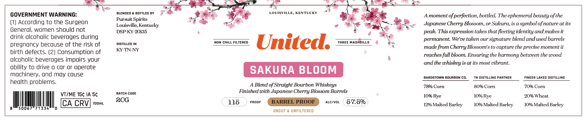

# TTB COLA Label Images - TTBID 26021001000341

**Brand Name:** UNITED

**Fanciful Name:** SAKURA BLOOM BOURBON

**Issue Date:** 01/27/2026

**Origin Code:** 22

**Product Class/Type:** 121

**Source:** [TTB Public COLA Registry](https://ttbonline.gov/colasonline/viewColaDetails.do?action=publicFormDisplay&ttbid=26021001000341)

## Label Images

### Back Label

### Label 2

## Extracted Label Text

*Text extracted via OCR - may contain errors*

### Back Label

> came

a ae

a

I

sLewneo & eornien ey

7

LOUISVILLE, KENTUCKY

“a

GOVERNMENT WARNING:

ee

Amoment of perfection, bottled. The ephemeral beauty of the

(1) According to the Surgeon

Pursuit Spirits

Louisville, Kentucky

*

Hr.

Japanese Cherry Blossom, or Sakura, is a symbol of nature at its

General, women should not

DSP-KY-20135

#8

=

peak. This expression takes that fleeting identity and makes it

drink alcoholic beverages during

a

ismuten

MON CHILL FILTERED.

ow ot

FILTERED

permanent. We've taken our signature blend and used barrels

Pregnancy because of the risk of

KY-TNNY

United. === «*.

‘made from Cherry Blossom's to capture the precise moment it

birth defects. (2) Consumption of

alcoholic beverages impairs your

a

reaches full bloom. Ensuring the harmony between the wood

and the whiskey isat its mast vibrant.

ability to drive o car or operate

machinery, and may couse

‘aaROsToWN BOURBON CO.

TWorgriue PARTNER

FINGER LAKES DISTILUNG

health problems.

A Blend of Straight Bourbon Whiskeys

78% Corn

80% Com

70% Corn

‘axreH cone

Finished with Japanese Cherry Blossom Barrels

VI/ME 15¢ IA 5¢

10% Rye

10% Rye

20% Wheat

acc

116

8

|

30067071534

IN

|

|

0

CA CRVJ zoom.

voor GERRRELPROGE) 2nm 57.5%

1296 Malted Barley

10% Malted Barley

10% Malted Barley

UNCUT & UNFILTERED

### Label 2

OUR PURSUIT

Our story began with a microphone that created the #1 whiskey
podeast, Bourbon Pursuit. We learned everything through thousands
of hours of candid conversations with industry experts. This
opportunity led us to partner with world-class distilleries and create

award winning whiskeys to share with you. Enjoy this pursuit.

FOUNDERS

a
A52-(—

KENNY COLEMAN
