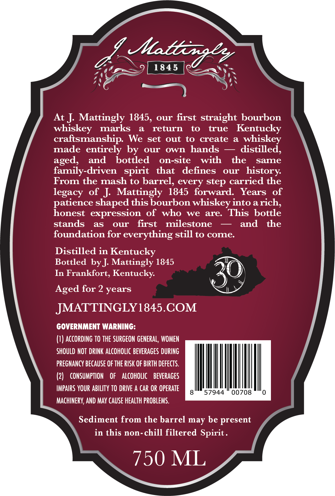
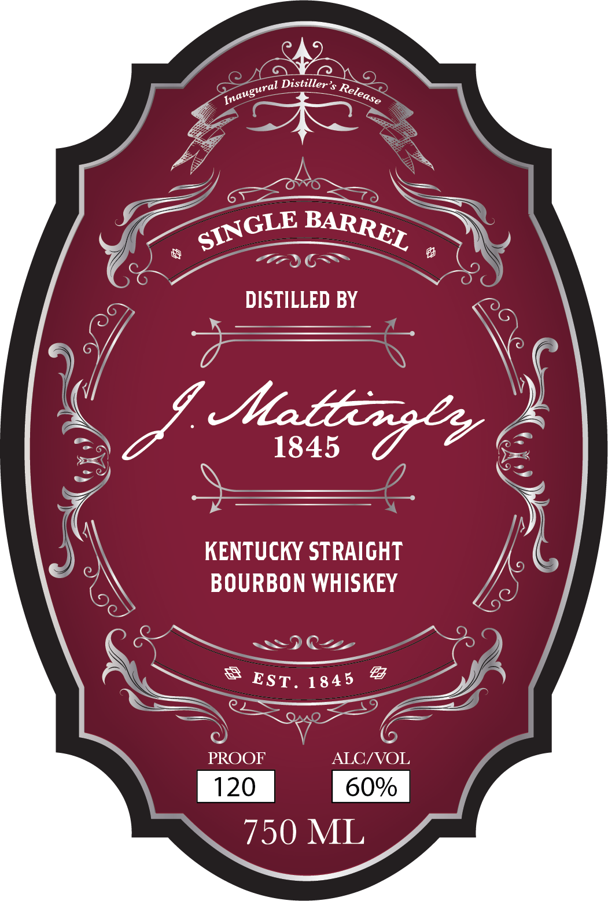
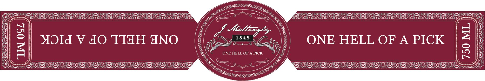

# TTB COLA Label Images - TTBID 26021001000567

**Brand Name:** J. MATTINGLY 1845

**Issue Date:** 01/23/2026

**Origin Code:** 22

**Product Class/Type:** 101

**Source:** [TTB Public COLA Registry](https://ttbonline.gov/colasonline/viewColaDetails.do?action=publicFormDisplay&ttbid=26021001000567)

## Label Images

### Back Label

### Front Label

### Label 3

### Label 4

## Extracted Label Text

*Text extracted via OCR - may contain errors*

*1 image(s) excluded: text did not meet readability threshold*

### Back Label

SR),

AG

—

At J. Mattingly 1845, our first straight bourbon
whiskey marks a return to true Kentucky
craftsmanship. We set out to create a whiskey
made entirely by our own hands — distilled,
aged, and bottled on-site with the same
family-driven spirit that defines our history.
From the mash to barrel, every step carried the
legacy of J. Mattingly 1845 forward. Years of
patience shaped this bourbon whiskey into a rich,
honest expression of who we are. This bottle
stands as our first milestone — and the
foundation for everything still to come.

Distilled in Kentucky
Bottled by J. Mattingly 1845
In Frankfort, Kentucky.

Aged for 2 years

JMATTINGLY1845.COM

GOVERNMENT WARNING:
(1) ACCORDING TO THE SURGEON GENERAL, WOMEN

SHOULD NOT DRINK ALCOHOLIC BEVERAGES DURING
PREGNANCY BECAUSE OFTHE RISK OF BIRTH DEFECTS.
(2) CONSUMPTION OF ALCOHOLIC BEVERAGES
IMPAIRS YOUR ABILITY TO DRIVE A CAR OR OPERATE (AML MC Romrt laut

MACHINERY, AND MAY CAUSE HEALTH PROBLEMS.

Sediment from the barrel may be present
in this non-chill filtered Spirit.

750 ML

### Front Label

al Distiller’s 7
gure, eS Reco,
ne ese

KENTUCKY STRAIGHT
BOURBON WHISKEY

— CG
as Wana SS —

PROOF ALC/VOL

750 ML

### Label 4

Liss

te

Se

LEE VEG EOLOLO LOLOL LO LO LOLS

Y

WA

PRLGLBLGLOEGLGLBLG LOL GL

—]

9

J Mtlip,

1845

—

Za

Ny

ONE HELL OF A PICK | 2

MOId V AO TIHH ANO (

ONE HELL OF A PICK

Se

ion

BD «

/&

|

ey

js

=

LEOLOLOLTLO SOLO LO LOO eos

ig

Sor URDU pes Opa peppeRreR Ee BED BEN

2

OG
