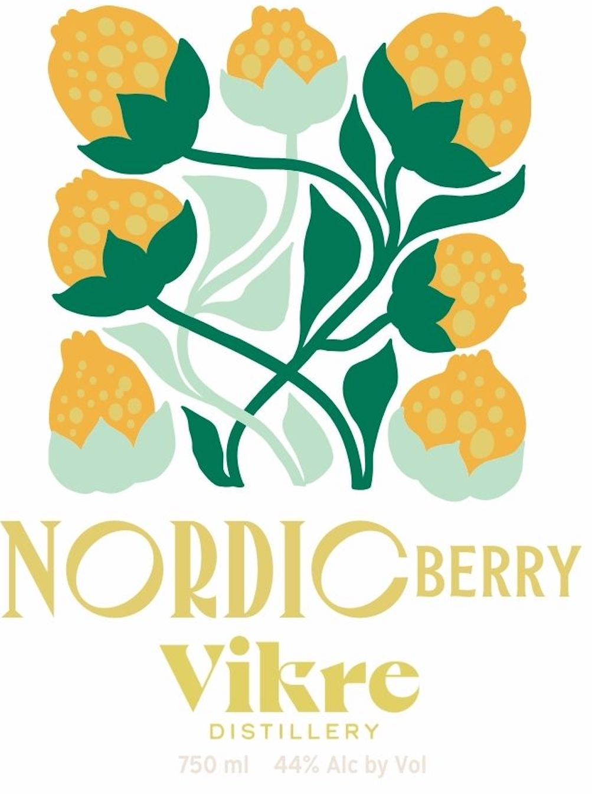
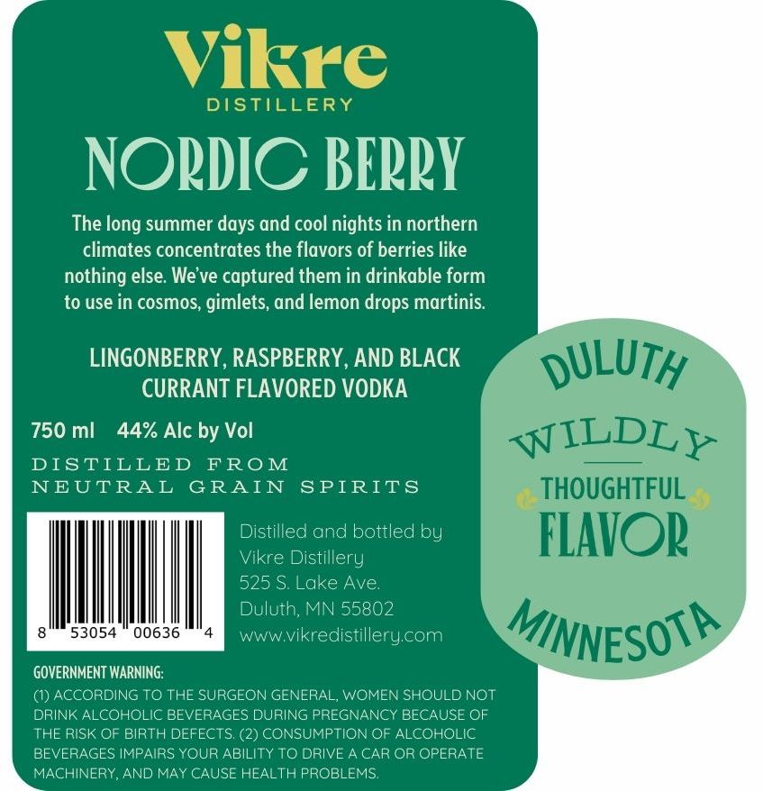

# TTB COLA Label Images - TTBID 26022001000186

**Brand Name:** VIKRE DISTILLERY

**Fanciful Name:** NORDIC BERRY

**Issue Date:** 02/04/2026

**Origin Code:** 27

**Product Class/Type:** 149

**Source:** [TTB Public COLA Registry](https://ttbonline.gov/colasonline/viewColaDetails.do?action=publicFormDisplay&ttbid=26022001000186)

## Label Images

### Back Label

### Label 1

## Extracted Label Text

*Text extracted via OCR - may contain errors*

*1 image(s) excluded: text did not meet readability threshold*

### Label 1

The long summer days and cool nights in northern
climates concentrates the flavors of berries like
nothing else. We've captured them in drinkable form
to use in cosmos, gimlets, and lemon drops martinis.
LINGONBERRY, RASPBERRY, AND BLACK ALU /Z
CURRANT FLAVORED VODKA :
750 ml 44% Alc by Vol qin eB
DISTILLED FROM = :
NEUTRAL GRAIN SPIRITS OU! JL
Distilled and bottled by ( 1)
Vikre Distillery 3 $
525 S. Lake Ave
Duluth, MN 55802 Ww Paw |
eee Me Mee ww Vikrecistillery.com ,"TINNECONY
GOVERNMENT WARNING:
(1) ACCORDING TO THE SURGEON GENERAL, WOMEN SHOULD NOT
DRINK ALCOHOLIC BEVERAGES DURING PREGNANCY BECAUSE OF
THE RISK OF BIRTH DEFECTS. (2) CONSUMPTION OF ALCOHOLIC
BEVERAGES IMPAIRS YOUR ABILITY TO DRIVE A CAR OR OPERATE
MACHINERY, AND MAY CAUSE HEALTH PROBLEMS.
