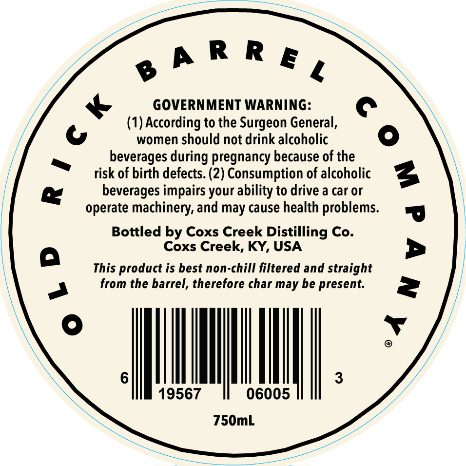
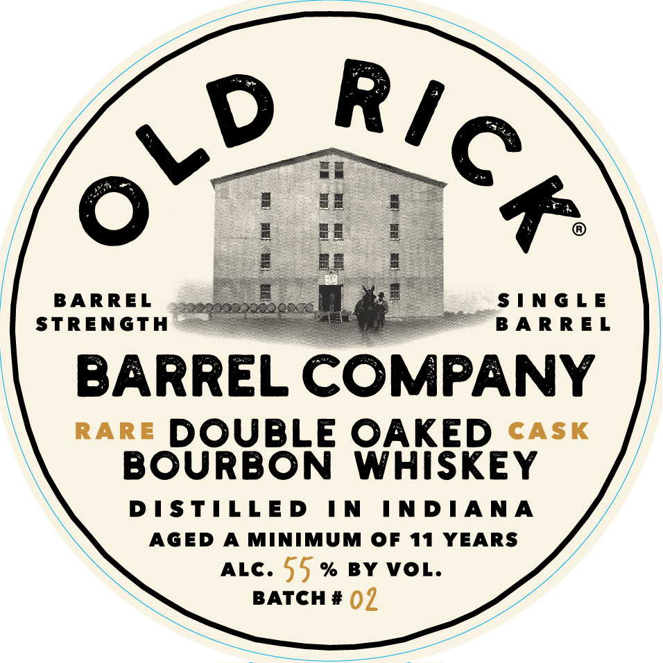

# TTB COLA Label Images - TTBID 26022001000233

**Brand Name:** OLD RICK

**Fanciful Name:** DOUBLE OAKED RARE CASK BOURBON WHISKEY

**Issue Date:** 01/26/2026

**Origin Code:** 22

**Product Class/Type:** 141

**Source:** [TTB Public COLA Registry](https://ttbonline.gov/colasonline/viewColaDetails.do?action=publicFormDisplay&ttbid=26022001000233)

## Label Images

### Back Label

### Front Label

## Extracted Label Text

*Text extracted via OCR - may contain errors*

### Back Label

eh Re,

GOVERNMENT WARNING:

(1) According to the Surgeon General,

ay Pal

women should not drink alcoholic

beverages during pregnancy because of the

~

risk of birth defects. (2) Consumption of alcoholic

&

beverages impairs your ability to drive a car or

operate machinery, and may cause health problems.

Bottled by Coxs Creek Distilling Co.

Coxs Creek, KY, USA

This product is best non-chill filtered and straight

a

from the barrel, therefore char may be present.

oe

3

19567

06005

750mL

### Front Label

R7

VD

-

BARREL

SINGLE

STRENGTH

BARREL

BARREL COMPANY

rare DOUBLE OAKED <aAs«

BOURBON WHISKEY

DISTILLED IN INDIANA

AGED A MINIMUM OF 11 YEARS

ALC. 55 % BY VOL.

BATCH # ()7
