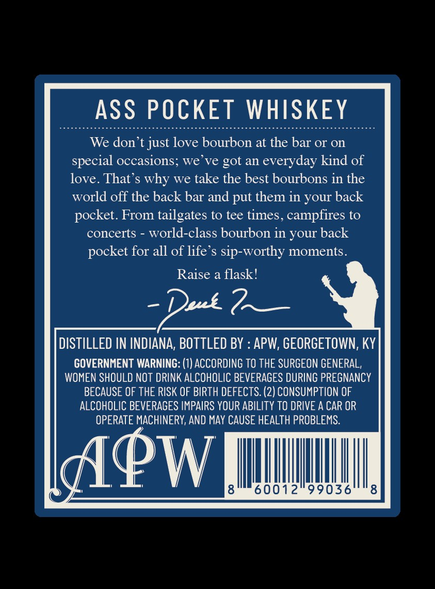
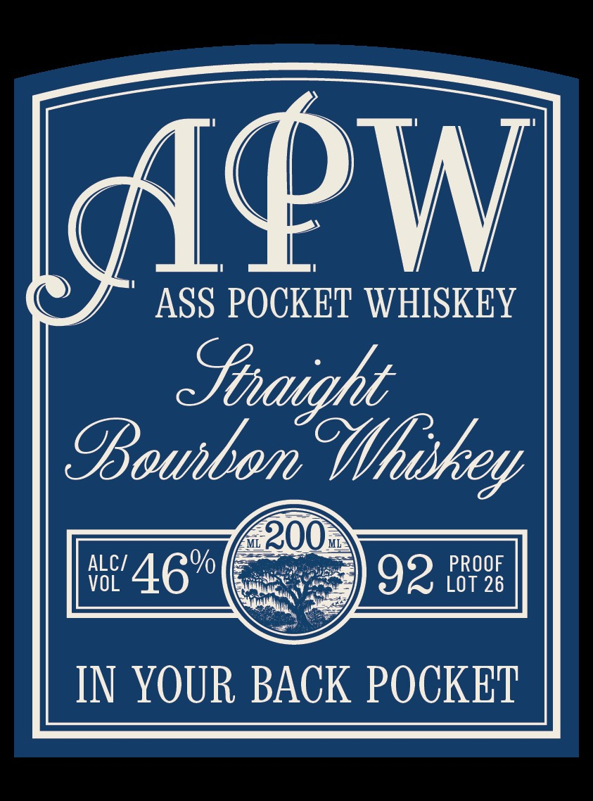

# TTB COLA Label Images - TTBID 26022001000393

**Brand Name:** APW ASS POCKET WHISKEY

**Issue Date:** 02/11/2026

**Origin Code:** 22

**Product Class/Type:** 101

**Source:** [TTB Public COLA Registry](https://ttbonline.gov/colasonline/viewColaDetails.do?action=publicFormDisplay&ttbid=26022001000393)

## Label Images

### Back Label

### Front Label

## Extracted Label Text

*Text extracted via OCR - may contain errors*

### Back Label

ASS POCKET WHISKEY

We don’t just love bourbon at the bar or on
special occasions; we’ve got an everyday kind of
love. That’s why we take the best bourbons in the
world off the back bar and put them in your back

pocket. From tailgates to tee times, campfires to
concerts - world-class bourbon in your back
pocket for all of life’s sip-worthy moments.

Raise a flask!

pe —

DISTILLED IN INDIANA, BOTTLED BY : APW, GEORGETOWN, KY

GOVERNMENT WARNING: (1) ACCORDING TO THE SURGEON GENERAL,
WOMEN SHOULD NOT DRINK ALCOHOLIC BEVERAGES DURING PREGNANCY
BECAUSE OF THE RISK OF BIRTH DEFECTS. (2) CONSUMPTION OF
ALCOHOLIC BEVERAGES IMPAIRS YOUR ABILITY TO DRIVE A CAR OR
OPERATE MACHINERY, AND MAY CAUSE HEALTH PROBLEMS.

8 III

### Front Label

APW

(© J” ASS POCKET WHISKEY
Shraight

Baurbon Whikey

IN YOUR BACK POCKET
