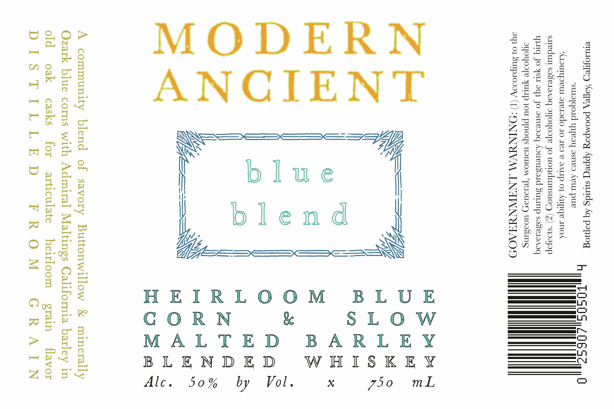

# TTB COLA Label Images - TTBID 26022001000422

**Brand Name:** MODERN ANCIENT

**Fanciful Name:** BLUE BLEND

**Issue Date:** 02/05/2026

**Origin Code:** 01

**Product Class/Type:** 137

**Source:** [TTB Public COLA Registry](https://ttbonline.gov/colasonline/viewColaDetails.do?action=publicFormDisplay&ttbid=26022001000422)

## Label Images

### Back Label

## Extracted Label Text

*Text extracted via OCR - may contain errors*

### Back Label

erusrogyer) AoTTeA poompoy Appecy stitdg Aq popog
‘suuatqoid yyeay osneo Avur pur
AJOUTYILUL 9]v19d0 10 Ted B DALIP 0} AjTIGe INOA
sTeduit saseioAoq ooyooye Jo uonduunsuory (Z) ‘saJop
Yq JO YS oy} JO asnevooq AouvUSaId SULINP SaseIIAIq
POYOoTR YULIp JOU pynoys USWUOM ‘Te1IUIF) UOISING

auf 01 Surp1099V (1) :NINWVM .LNAWNYAAOD

| | |

Ue Sey O

A community blend of savory Buttonwillow & minerally
Ozark blue corns with Admiral Maltings California barley in
old oak casks for articulate
DIS TILLED

flavor
GRAIN

heirloom — grain

FROM

al Sp
a re
ewe P| aces"
Tp) FS

aa) Jo © | <a x
a3 3 & = ms
— @) O & ~
a = o Aas
O DO O = aa
OZ | ywZbhR |
aH es

DP WY -

a <i nen odd
GZoOsanx
