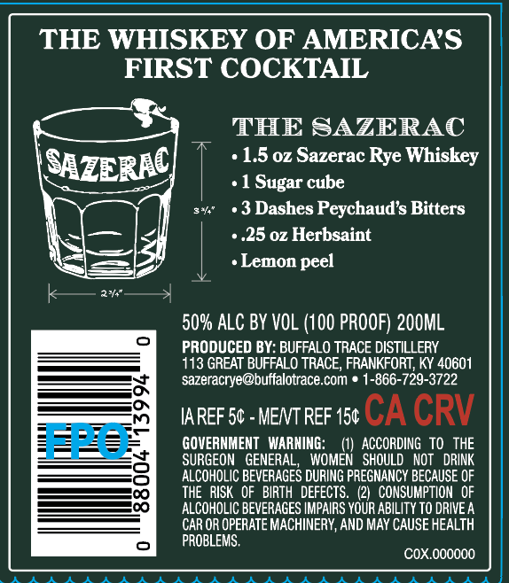
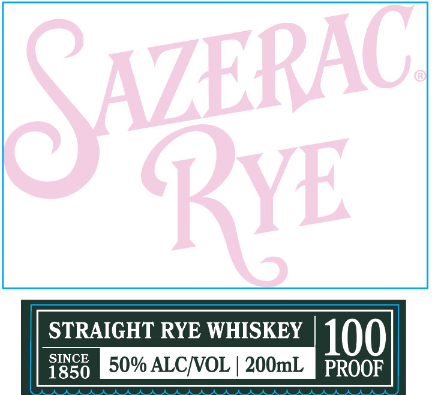

# TTB COLA Label Images - TTBID 26022001000528

**Brand Name:** SAZERAC RYE

**Issue Date:** 01/23/2026

**Origin Code:** 22

**Product Class/Type:** 102

**Source:** [TTB Public COLA Registry](https://ttbonline.gov/colasonline/viewColaDetails.do?action=publicFormDisplay&ttbid=26022001000528)

## Label Images

### Back Label

### Front Label

## Extracted Label Text

*Text extracted via OCR - may contain errors*

### Back Label

THE WHISKEY OF AMERICA’S

FIRST COCKTAIL

THE SAZERAC

«1.5 oz Sazerac Rye Whiskey

«1 Sugar cube

sh

«3 Dashes Peychaud’s Bitters

5 |

+ .25 oz Herbsaint

4 i

«Lemon peel

ae

50% ALC BY VOL (100 PROOF) 200ML

PRODUCED BY: BUFFALO TRACE DISTILLERY

113 GREAT BUFFALO TRACE, FRANKFORT, KY 40601

—;

sazeracrye@buffalotrace.com © 1-866-729-3722

IAREF 5¢ - ME/VT REF 15¢ CA CRV

GOVERNMENT WARNING:

(1) ACCORDING TO THE

ALCOHOLIC BEVERAGES DURING PREGNANCY BECAUSE OF

SURGEON GENERAL, WOMEN SHOULD NOT DRINK

=

THE RISK OF BIRTH DEFECTS. (2) CONSUMPTION OF

ALCOHOLIC BEVERAGES IMPAIRS YOUR ABILITY TO DRIVE A

CAR OR OPERATE MACHINERY, AND MAY CAUSE HEALTH

PROBLEMS.

COX.000000

### Front Label

STRAIGHT RYE WHISKEY

SINCE

1850

50% ALC/VOL | 200mL Bates
