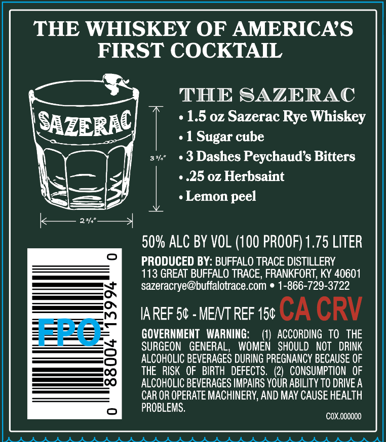
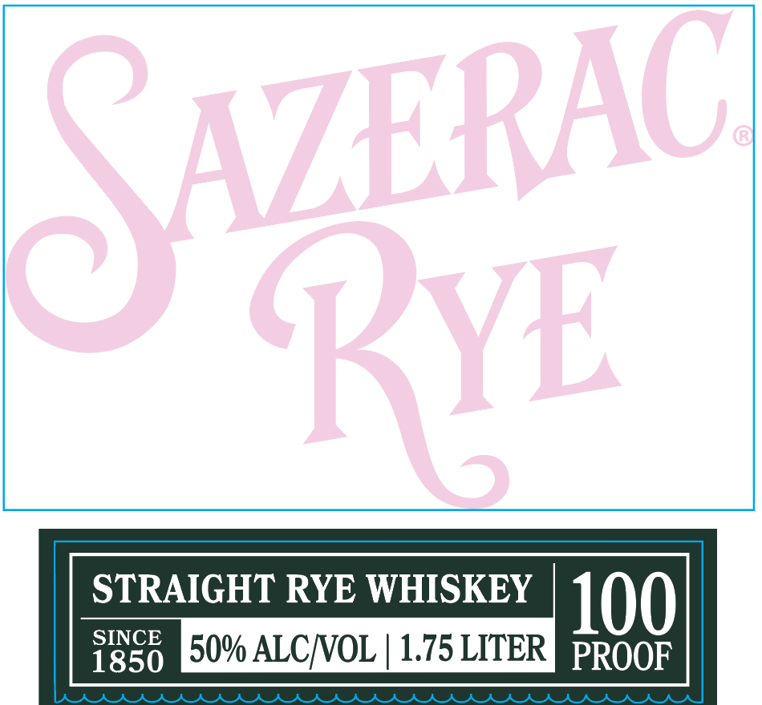

# TTB COLA Label Images - TTBID 26022001000537

**Brand Name:** SAZERAC RYE

**Issue Date:** 01/23/2026

**Origin Code:** 22

**Product Class/Type:** 102

**Source:** [TTB Public COLA Registry](https://ttbonline.gov/colasonline/viewColaDetails.do?action=publicFormDisplay&ttbid=26022001000537)

## Label Images

### Back Label

### Front Label

## Extracted Label Text

*Text extracted via OCR - may contain errors*

### Back Label

THE WHISKEY OF AMERICA’S

FIRST COCKTAIL

THE SAZERAC

—

«1.5 oz Sazerac Rye Whiskey

SazERAE

¢ 1 Sugar cube

3%

«3 Dashes Peychaud’s Bitters

\

~|—— |<

- .25 oz Herbsaint

| ene

—

«Lemon peel

je — 2% —+

50% ALC BY VOL (100 PROOF) 1.75 LITER

PRODUCED BY: BUFFALO TRACE DISTILLERY

113 GREAT BUFFALO TRACE, FRANKFORT, KY 40601

sazeracrye@buffalotrace.com © 1-866-729-3722

——e ON

IAREF 5¢ - MENT REF 15¢ CA CRV

GOVERNMENT WARNING:

(1) ACCORDING TO THE

SURGEON GENERAL, WOMEN SHOULD NOT DRINK

ALCOHOLIC BEVERAGES DURING PREGNANCY BECAUSE OF

S00

THE RISK OF BIRTH DEFECTS. (2) CONSUMPTION OF

———O0O

ALCOHOLIC BEVERAGES IMPAIRS YOUR ABILITY TO DRIVE A

CAR OR OPERATE MACHINERY, AND MAY CAUSE HEALTH

PROBLEMS.

COx.000000

IA AA AK AKRAAAAAAKRKRA AAR ARR ARAAAR RAR ARARA AKA AI

### Front Label

0

= EO RYE WHISKEY

0% ALC/VOL | 1.75 LITER 5 :%eyeya
