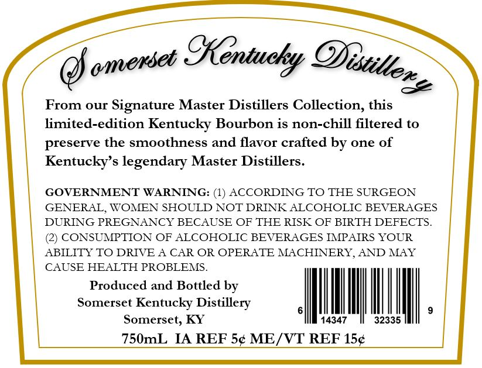
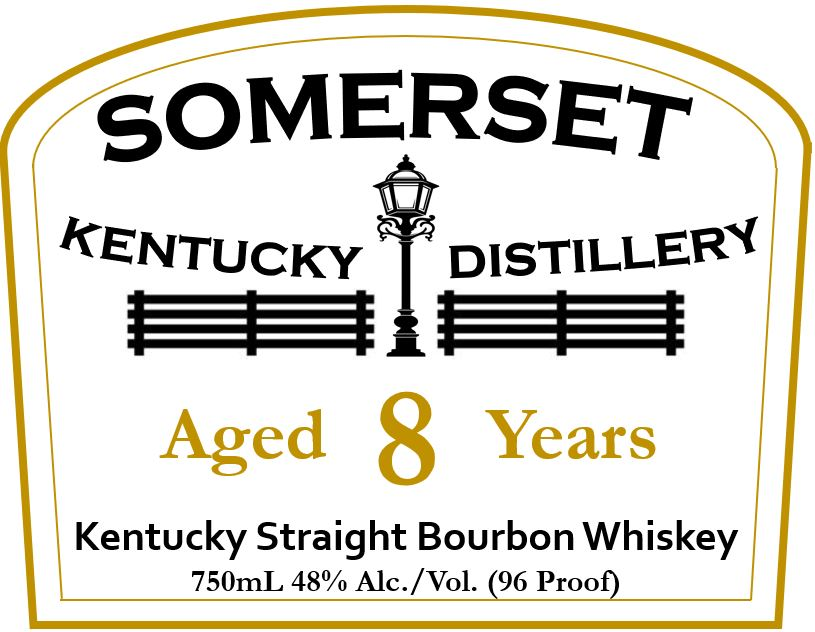

# TTB COLA Label Images - TTBID 26023001000045

**Brand Name:** SOMERSET KENTUCKY DISTILLERY

**Issue Date:** 01/26/2026

**Origin Code:** 22

**Product Class/Type:** 101

**Source:** [TTB Public COLA Registry](https://ttbonline.gov/colasonline/viewColaDetails.do?action=publicFormDisplay&ttbid=26023001000045)

## Label Images

### Back Label

### Front Label

## Extracted Label Text

*Text extracted via OCR - may contain errors*

### Back Label

ose

From our Signature Master Distillers Collection, this

limited-edition Kentucky Bourbon is non-chill filtered to
preserve the smoothness and flavor crafted by one of
Kentucky’s legendary Master Distillers.

GOVERNMENT WARNING: (1) ACCORDING TO THE SURGEON
GENERAL, WOMEN SHOULD NOT DRINK ALCOHOLIC BEVERAGES
DURING PREGNANCY BECAUSE OF THE RISK OF BIRTH DEFECTS.
(2) CONSUMPTION OF ALCOHOLIC BEVERAGES IMPAIRS YOUR
ABILITY TO DRIVE A CAR OR OPERATE MACHINERY, AND MAY
CAUSE HEALTH PROBLEMS.
Produced and Bottled by
Somerset Kentucky Distillery @ oi
Somerset, KY 14347 32335

750mL IA REF 5¢ ME/VT REF 15¢

### Front Label

SOMERSET
i
KENTUCKY | DISTILLERY
SS]. =
Aged 8 Years
Kentucky Straight Bourbon Whiskey
750mL 48% Alc./Vol. (96 Proo:
