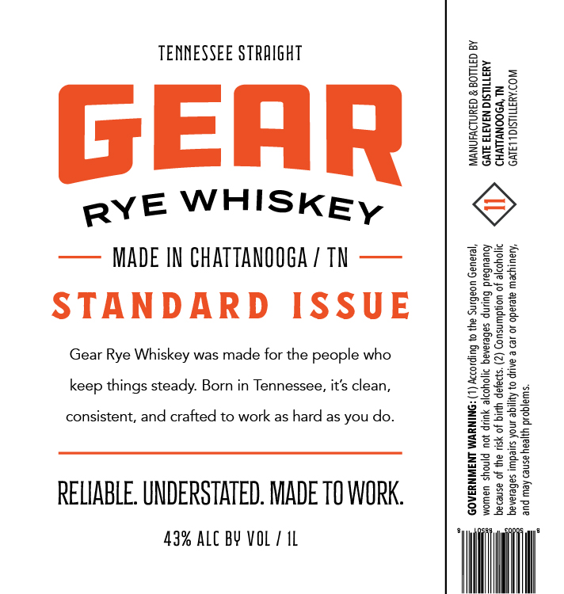

# TTB COLA Label Images - TTBID 26023001000076

**Brand Name:** GEAR RYE WHISKEY

**Issue Date:** 02/04/2026

**Origin Code:** 43

**Product Class/Type:** 102

**Source:** [TTB Public COLA Registry](https://ttbonline.gov/colasonline/viewColaDetails.do?action=publicFormDisplay&ttbid=26023001000076)

## Label Images

### Label 1

## Extracted Label Text

*Text extracted via OCR - may contain errors*

### Label 1

TENNESSEE STRAIGHT a.
= & z
FL
PEE:
RYE WHISKEy ©@
—— MADE IN CHATTANOOGA / TN —— en
S255
B2e8
STANDARD ISSUE | iii
Gear Rye Whiskey was made for the people who ere :
keep things steady. Bor in Tenniesses, i’sdean, pee 2
consistent, and crafted to work as hard as you do. a2832
Ets
a Bess
Brees
RELIABLE. UNDERSTATED. MADE TO WORK. gisee
“me” Wut
