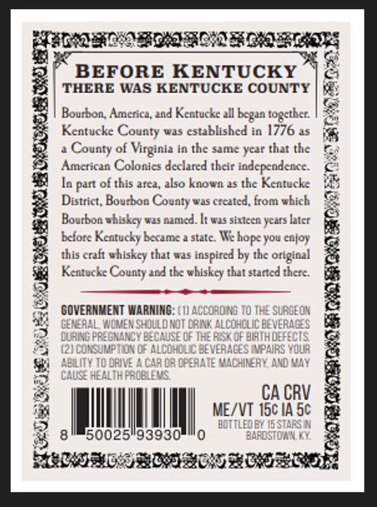
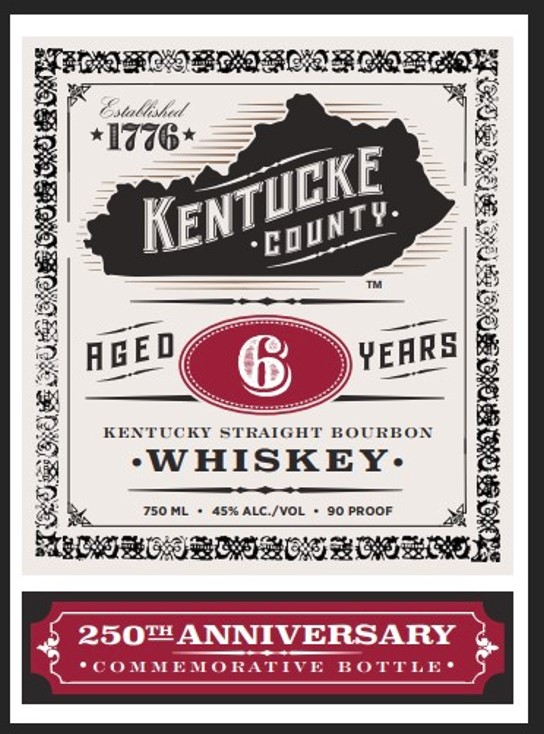

# TTB COLA Label Images - TTBID 26023001000087

**Brand Name:** KENTUCKE COUNTY

**Issue Date:** 01/26/2026

**Origin Code:** 22

**Product Class/Type:** 101

**Source:** [TTB Public COLA Registry](https://ttbonline.gov/colasonline/viewColaDetails.do?action=publicFormDisplay&ttbid=26023001000087)

## Label Images

### Back Label

### Label 1

### Label 3

## Extracted Label Text

*Text extracted via OCR - may contain errors*

### Back Label

oy

CEQA R OD FOROS

BEFORE KENTUCKY

a

%

THERE WAS KENTUCKE COUNTY

Bourbon, America, and Kentucke all began together.

Kentucke County was established in 1776 as

a County of Virginia in the same year that the

American Colonies declared their independence

a

me

In part of this area, also known as the Kentucke

&

District, Bourbon County was created, from whic

Bourbon whiskey was named. It was sixteen years later

fe

before Kentucky became a state. We hope you enjoy

this craft whiskey that was inspired by the original

Kentucke County and the whiskey that started there.

e

©

GOVERNMENT WARNING:

on

XK

RISK

ATH

i

iy

a

&

CA CRV

ME/\T 1c IA 50

id

f

tl

I

J

50025!

93930

ll,

rm

Fae punacenemnemcs sosecenainsd

### Label 1

Fs Satta

lalleshed

[<)

*17W6*

&

&

Jc

KE

fe

NT?

ae

Q

gi

&

AGED

YEARS

ee

i

6

mA

KENTUCKY STRAIC

: BOURBON

)

“WHISKEY:

e

750ML + 45% ALC./VOL + 90 PROOF

2k

5

RY‘

fad

tC *cC

250™

ee

NNIVERS/

Ca i

==

ft

### Label 3

Qhle

G

PEAR
