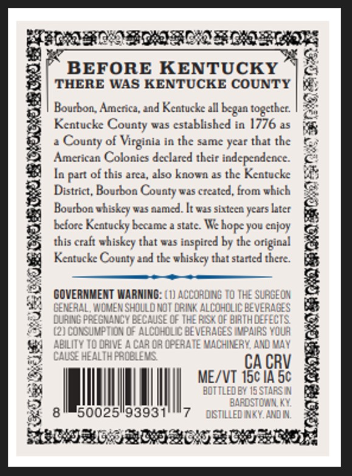
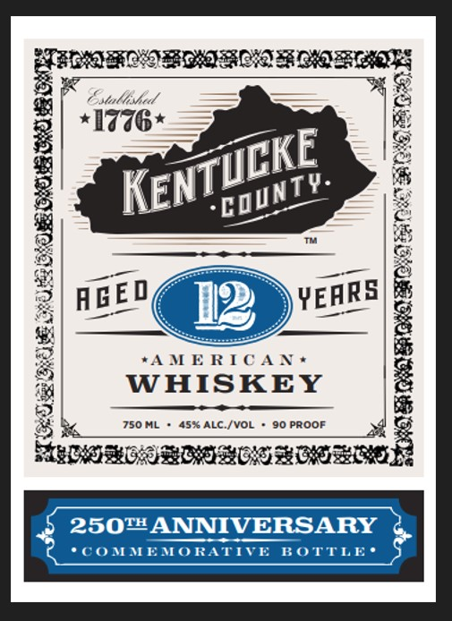

# TTB COLA Label Images - TTBID 26023001000094

**Brand Name:** KENTUCKE COUNTY

**Issue Date:** 01/26/2026

**Origin Code:** 22

**Product Class/Type:** 140

**Source:** [TTB Public COLA Registry](https://ttbonline.gov/colasonline/viewColaDetails.do?action=publicFormDisplay&ttbid=26023001000094)

## Label Images

### Back Label

### Label 1

### Label 3

## Extracted Label Text

*Text extracted via OCR - may contain errors*

*1 image(s) excluded: text did not meet readability threshold*

### Back Label

7
z BEFORE KENTUCKY |G
THERE WAS KENTUCKE COUNTY | }#)
ts
2 Bourbon, America, and Kentucke all begaa together. | 2,
Keatucke County was established in 1776 as jg
} a County of Virginia in the same year that the Ge
American Colonies declared their independence.
$B) In part of this area, also known as the Kentucke {4%
District, Bourbon County was created, from which
Bourbon whiskey was aamed. [t was sixteen years later &
before Keatucky became a state. We hope you enjoy
2 this craft whiskey that was inspired by the original g
=| Kentucke County and the whiskey that started there. i
= ———- + 2
A> 4 3
yy GOVERNMENT WARNING: (1) ACCOROINS TO THE SURSEON
S22 GENERAL WOMEN SHOULD NOT DRINK ALCOMOLICBEVERAGES BRS
2. DURING PREGNANCY BECAUSE OF THE RISK OF BIRTH DEFECTS =
SJ (2) CONSUMPTION OF ALCOHOLIC BEVERAGES IMPAIRS YOUR
$941 ABILITY TO DRIVE A CAR OR OPERATE MACHINERY, AND MAY
esy CAUSE HEALTH PROBLEMS.
me CACRV @
7) ME/VT 15¢ IA 5¢
134 BOTTLED BY 15STARSIN RAB
| BARDSTOIN, KY
8 850025939317 —OSTILLEDINKY. ANON 2

### Label 1

gh

Henna RONEN aE

POOCBOIRID FOO AOS

See ees
x

*AMERICAN®*

WHISKEY

c./VOI

wR
eC
&
pens
&
RS
é
At
