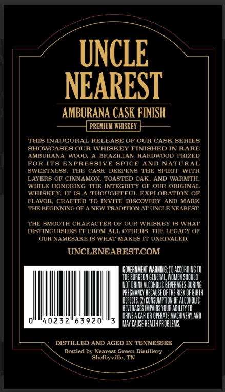
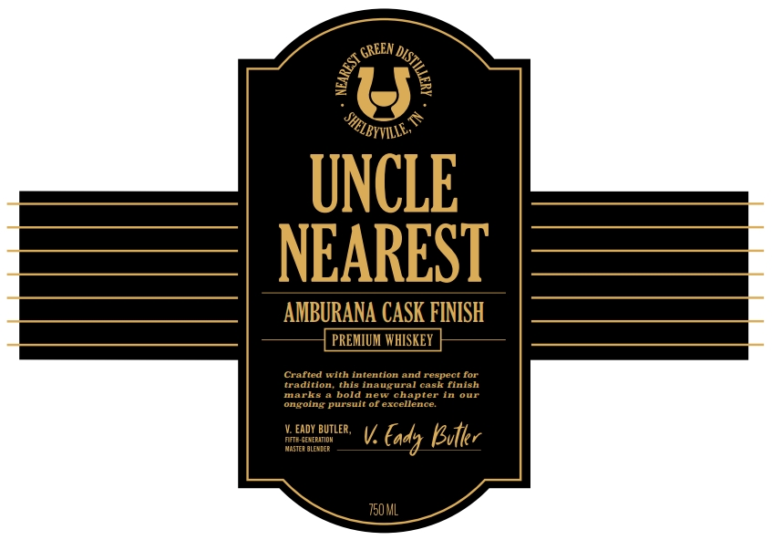
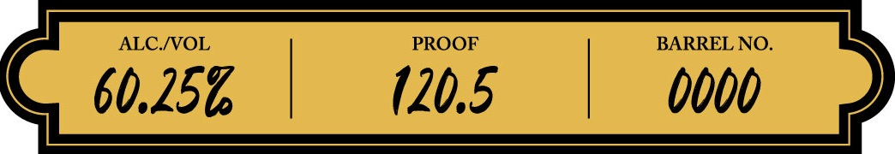
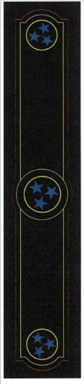

# TTB COLA Label Images - TTBID 26023001000105

**Brand Name:** UNCLE NEAREST

**Issue Date:** 02/06/2026

**Origin Code:** 43

**Product Class/Type:** 140

**Source:** [TTB Public COLA Registry](https://ttbonline.gov/colasonline/viewColaDetails.do?action=publicFormDisplay&ttbid=26023001000105)

## Label Images

### Back Label

### Front Label

### Label 2

### Label 3

## Extracted Label Text

*Text extracted via OCR - may contain errors*

### Back Label

UNCLE

NEAREST

AMBURANA CASK FINISH

PREMIUM WHISKEY

‘THIS INAUGURAL RE

As

OF OUR CASK SERIES

SHOWC:

OUR WHISKEY

INISHED IN RARE

AMBU

NA WOOD,

BRAZ

N HARDWOOD PRIZED

FOR

XPRE

Iv

CE AND NATURAL

sw

‘NESS.

HE CASK DEEPENS THE SPIRIT WITH

LAYERS OF CINNAMON, TOASTED OAK, AND WARMTH.

wit

HONORING THE INT

Ri

'Y OF OUR ORIGINAL

WHISKEY, IT IS A THOUGHTFUL

XPLORATION OF

FLAVOR, CRU

TE

TO INVITE D

COVERY

AND MARK

THE BEGINNING OF A NE

TRADITION AT UNCLE NEAREST

THE SMOOTH CHARACTER OF OUR WHISKEY IS WHAT

DISTINGUISHES IT FROM ALL OTHI

THE LEGACY OF

OUR NAMESAKE IS WHAT MAKE

IT UNRIVALED.

UNCLENEAREST.COM

‘GOVERNMENT WARNING: (1) ACCORDING 10

THE SURGEON GENERAL WOMEN SHOULD

NDT ORING ALCOHOLIC BEVERAGES DURING

PREGNANCY BECAUSE OF THE RISK OF BIRTH

DEFECTS. (2) CONSUMPTION OF ALCOHOLIC

AEVERAGES IMPAIRS YOUR ABILITY TO

I

DRIVE CAR OR OPERATE MACHINERY, AND

0

0232"63920'

Ba VAY CASE NEATH ROBLES,

DISTILLED AND AGED IN TENNESSEE

Bottled by Nearest

reen Distillery

‘Shelbyville, TN

### Front Label

gre

EN yy,

UNCLE

NEAREST

AMBURAN.

ISH

V. EADY BUTLER, UV body Biter

TSOML

### Label 2

60.256, |

120.5

| 0000

### Label 3

G®)

@
