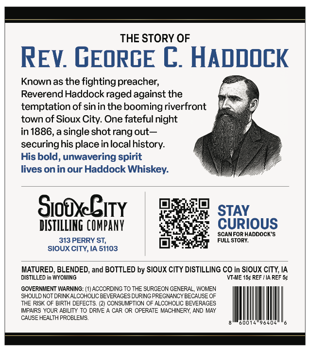
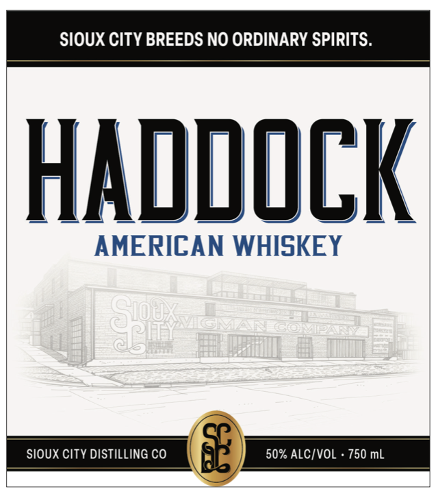

# TTB COLA Label Images - TTBID 26023001000385

**Brand Name:** HADDOCK

**Issue Date:** 02/04/2026

**Origin Code:** 20

**Product Class/Type:** 140

**Source:** [TTB Public COLA Registry](https://ttbonline.gov/colasonline/viewColaDetails.do?action=publicFormDisplay&ttbid=26023001000385)

## Label Images

### Back Label

### Front Label

## Extracted Label Text

*Text extracted via OCR - may contain errors*

### Back Label

———

THE STORY OF

REV. GEORGE C. HADDOCK

Knownas the fighting preacher,

Reverend Haddock raged against the

temptation of sin in the booming riverfront

town of Sioux City. One fateful night

in 1886, a single shot rang out—

f

securing his place in local history.

His bold, unwavering spirit

lives on in our Haddock Whiskey.

F) stay

SiodEity

DISTILLING COMPANY

CURIOUS

F.  SCANFORHADDOCK’S

313 PERRY ST,

FULLSTORY.

SIOUX CITY, IA 51103

DISTILLED in WYOMING

MATURED, BLENDED, and BOTTLED by SIOUX CITY DISTILLING CO in SIOUX CITY, IA

‘VEAME 15¢ REF | IA REF 5¢

‘SHOULD NOT DRINK ALCOHOLIC BEVERAGES DURING PREGNANCY BECAUSE OF

GOVERNMENT WARNING: (1) ACCORDING TO THE SURGEON GENERAL, WOMEN

THE RISK OF BIRTH DEFECTS. (2) CONSUMPTION OF ALCOHOLIC BEVERAGES

IMPAIRS YOUR ABILITY TO DRIVE A CAR OR OPERATE MACHINERY, AND MAY

CAUSE HEALTH PROBLEMS.

alMsootetseqosl le

(ES

### Front Label

AMERICAN WHISKEY
