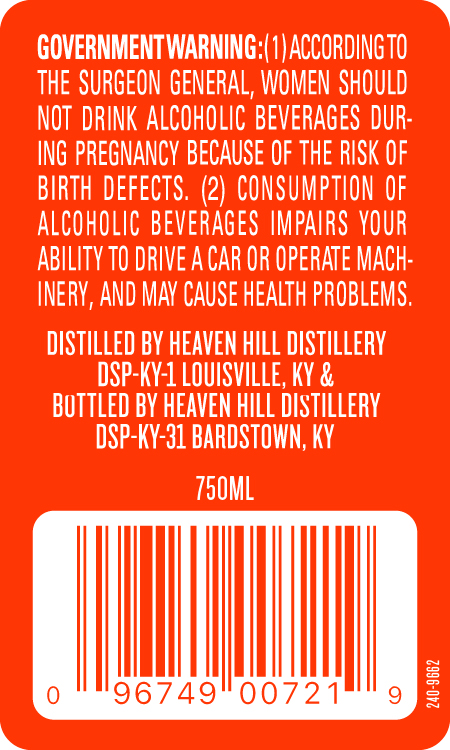
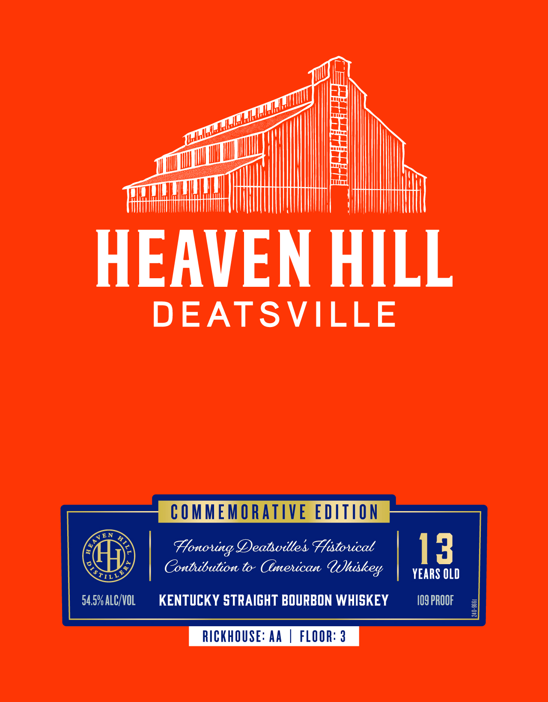

# TTB COLA Label Images - TTBID 26023001000575

**Brand Name:** HEAVEN HILL

**Fanciful Name:** DEATSVILLE

**Issue Date:** 01/28/2026

**Origin Code:** 22

**Product Class/Type:** 101

**Source:** [TTB Public COLA Registry](https://ttbonline.gov/colasonline/viewColaDetails.do?action=publicFormDisplay&ttbid=26023001000575)

## Label Images

### Back Label

### Front Label

### Label 3

## Extracted Label Text

*Text extracted via OCR - may contain errors*

*2 image(s) excluded: text did not meet readability threshold*

### Back Label

GOVERNMENT WARNING:(1)ACCORDINGTO

THE SURGEON GENERAL, WOMEN SHOULD

NOT DRINK ALCOHOLIC BEVERAGES DUR

ING PREGNANCY BECAUSE OF THE RISK OF

ALCOHOLIC BEVERAGES IMPAIRS YOUR

BIRTH DEFECTS. (2) CONSUMPTION OF

ABILITY TO DRIVE ACAR OR OPERATE MACH

INERY, AND MAY CAUSE HEALTH PROBLEMS

DISTILLED BY HEAVEN HILL DISTILLERY

DSP-KY-1 LOUISVILLE, KY &

BOTTLED BY HEAVEN HILL DISTILLERY

DSP-KY-31 BARDSTOWN, KY

TS0ML

AMIN
