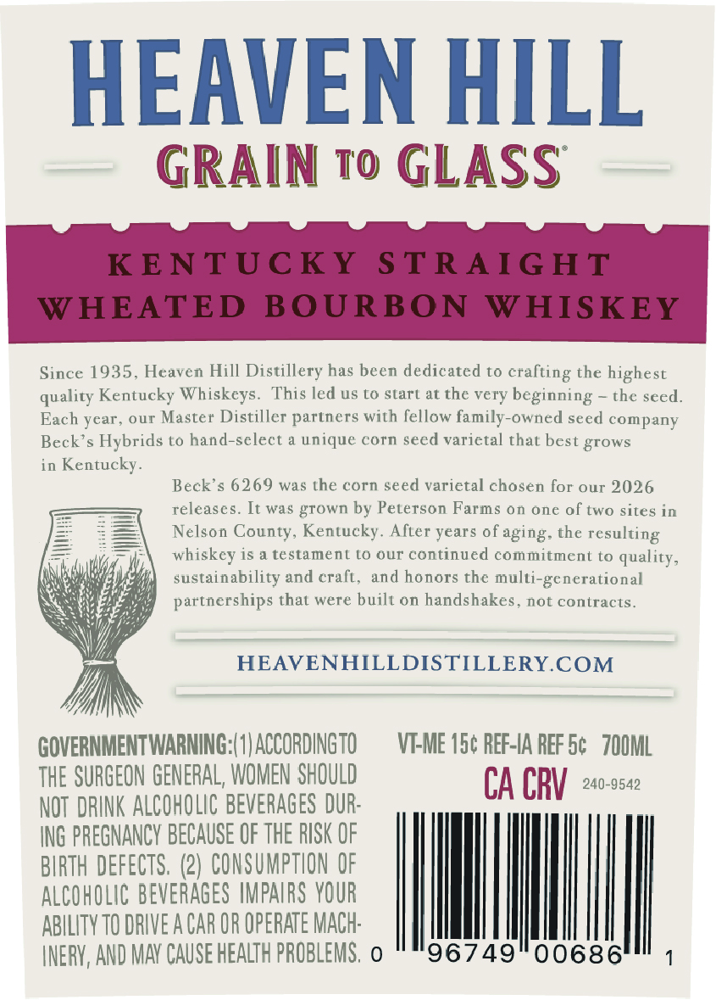
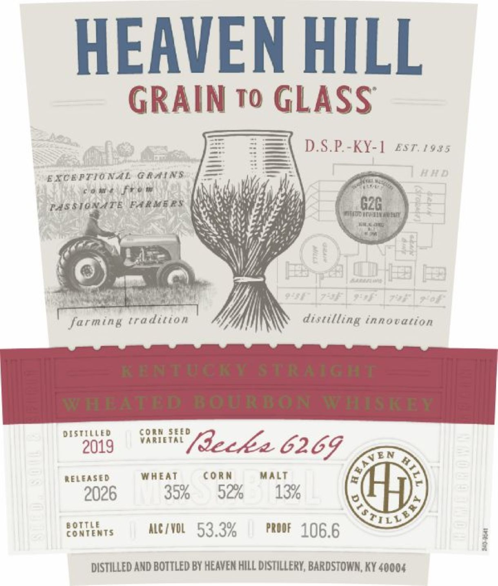

# TTB COLA Label Images - TTBID 26023001000678

**Brand Name:** HEAVEN HILL

**Fanciful Name:** GRAIN TO GLASS

**Issue Date:** 01/26/2026

**Origin Code:** 22

**Product Class/Type:** 101

**Source:** [TTB Public COLA Registry](https://ttbonline.gov/colasonline/viewColaDetails.do?action=publicFormDisplay&ttbid=26023001000678)

## Label Images

### Back Label

### Label 1

## Extracted Label Text

*Text extracted via OCR - may contain errors*

### Back Label

HEAVEN HILL

GRAIN T0 GLASS

Since 1935, Heaven Hill Distillery has been dedicated to crafting the highest

quality Kentucky Whisk

This led us to start at the very beginning ~ the seed

Each year, our Master Distiller partners with fellow family-owned seed company

Beck’s Hybrids to hand-select a unique corn seed varictal that best grow

in Kentucky

Beck’s 6269 was the corn seed varietal chosen for our 2026

releases. It was grown by Peterson Farms on one of two sites in

Nelson County, Kentucky. After years of aging. the resulting

whiskey is a testament to our continued commitment to quality

ustainability and craft, and honors the multi-generational

partnerships that were built on handshakes, not contract

HEAVENHILLDISTILLERY.COM

Yi)

GOVERNMENT WARNING:(1) ACCORDINGTO

VI-ME 15¢ REF-IA REF 5¢ 700ML

THE SURGEON GENERAL, WOMEN SHOULD

NOT DRINK ALCOHOLIC BEVERAGES DUR-

CA CRV 240-9542

ING PREGNANCY BECAUSE OF THE RISK OF

BIRTH DEFECTS. (2) CONSUMPTION OF

ALCOHOLIC BEVERAGES IMPAIRS YOUR

ABILITY T0 DRIVE A CAR OR OPERATE MACH-

|

INERY, AND MAY CAUSE HEALTH PROBLEMS, o

96749

|]

### Label 1

HEAVEN HILL

GRAIN To GLASS

D.S.P.-KY-1 EST. 1935

EXCEPTIONAL GRAINS

VAL

come fro w

AN

tien

vay

M4,

PASSIONATE FARMERS

i

My

“4

Wy

Ny]

te

4

iat

inom rte

Wate coy

xs

\

‘)

ney

9

<™

t,

fits,

fee,

i A

<

fre

s\

Uy

am | o

Nee

oa

os

a

W

distilling innovation

farming tradition

DISTILLED

CORN SEE

VARIETAL

2019

(leche 6269

VEN

CORN

MALT

RELEASED

WHEAT

2026

35%

92%

13%

Tre

BOTTLE

CONTENTS

ALC / VOL

J

RQ 90

Vv

4

0/o

PROOF 406.6

DISTILLED AND BOTTLED BY HEAVEN HILL DISTILLERY, BARDSTOWN, KY 40004
