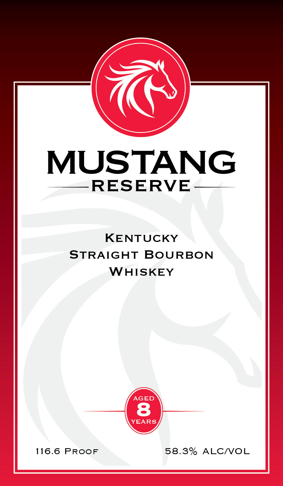
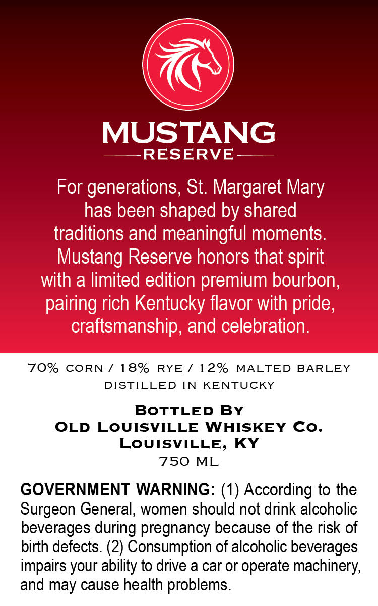

# TTB COLA Label Images - TTBID 26023001000946

**Brand Name:** MUSTANG RESERVE

**Issue Date:** 01/26/2026

**Origin Code:** 22

**Product Class/Type:** 101

**Source:** [TTB Public COLA Registry](https://ttbonline.gov/colasonline/viewColaDetails.do?action=publicFormDisplay&ttbid=26023001000946)

## Label Images

### Label 1

### Label 2

## Extracted Label Text

*Text extracted via OCR - may contain errors*

### Label 1

MUSTANG

——RESERVE——

KENTUCKY
STRAIGHT BOURBON
WHISKEY

116.6 PROOF 58.38% ALC/VOL

### Label 2

——RESERVE——
For generations, St. Margaret Mary
has been shaped by shared _
traditions and meaningful moments.
Mustang Reserve honors that spirit
with a limited edition premium bourbon,
70% CORN / 18% RYE/ 12% MALTED BARLEY
DISTILLED IN KENTUCKY
BOTTLED BY
OLD LOUISVILLE WHISKEY Co.
LOUISVILLE, KY
750 ML
GOVERNMENT WARNING: (1) According to the
Surgeon General, women should not drink alcoholic
beverages during pregnancy because of the risk of
birth defects. (2) Consumption of alcoholic beverages
impairs your ability to drive a car or operate machinery,
and may cause health problems.
