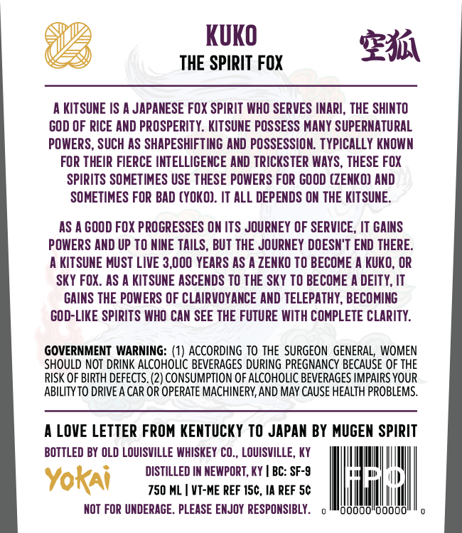
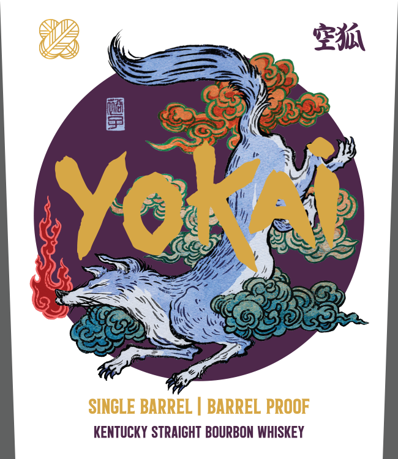

# TTB COLA Label Images - TTBID 26024001000001

**Brand Name:** YOKAI

**Issue Date:** 01/27/2026

**Origin Code:** 22

**Product Class/Type:** 101

**Source:** [TTB Public COLA Registry](https://ttbonline.gov/colasonline/viewColaDetails.do?action=publicFormDisplay&ttbid=26024001000001)

## Label Images

### Back Label

### Front Label

### Label 2

### Label 4

## Extracted Label Text

*Text extracted via OCR - may contain errors*

*2 image(s) excluded: text did not meet readability threshold*

### Back Label

KUKO

Fai

@

THE SPIRIT FOX

AKITSUNE IS A JAPANESE FOX SPIRIT WHO SERVES INARI, THE SHINTO

GOD OF RICE AND PROSPERITY. KITSUNE POSSESS MANY SUPERNATURAL

POWERS, SUCH AS SHAPESHIFTING AND POSSESSION. TYPICALLY KNOWN

FOR THEIR FIERCE INTELLIGENCE AND TRICKSTER WAYS, THESE FOX

SPIRITS SOMETIMES USE THESE POWERS FOR GOOD (ZENKO) AND

SOMETIMES FOR BAD (YOKO). IT ALL DEPENDS ON THE KITSUNE.

AS AGOOD FOX PROGRESSES ON ITS JOURNEY OF SERVICE, IT GAINS

POWERS AND UP TO NINE TAILS, BUT THE JOURNEY DOESN'T END THERE.

AKITSUNE MUST LIVE 3,000 YEARS AS A ZENKO TO BECOME A KUKO, OR

SKY FOX. AS A KITSUNE ASCENDS TO THE SKY TO BECOME A DEITY, IT

GAINS THE POWERS OF CLAIRVOYANCE AND TELEPATHY, BECOMING

GOD-LIKE SPIRITS WHO CAN SEE THE FUTURE WITH COMPLETE CLARITY.

GOVERNMENT WARNING: (1) ACCORDING TO THE SURGEON GENERAL, WOMEN

SHOULD NOT DRINK ALCOHOLIC BEVERAGES DURING PREGNANCY BECAUSE OF THE

RISK OF BIRTH DEFECTS. (2) CONSUMPTION OF ALCOHOLIC BEVERAGES IMPAIRS YOUR

ABILITY TO DRIVE A CAR OR OPERATE MACHINERY, AND MAY CAUSE HEALTH PROBLEMS.

A LOVE LETTER FROM KENTUCKY TO JAPAN BY MUGEN SPIRIT

BOTTLED BY OLD LOUISVILLE WHISKEY CO., LOUISVILLE, KY

Wi il

DISTILLED IN NEWPORT, KY | BC: SF-9

i

oD

Yokai

750 ML | VI-ME REF 15¢, IA REF 5¢

NOT FOR UNDERAGE. PLEASE ENJOY RESPONSIBLY.

o

'00000"00000'

ili

### Label 2

JIVUIN V

ind 4av

SAV Ia0
CF
4]
CHOP
WOOD
CARRY
WATER
