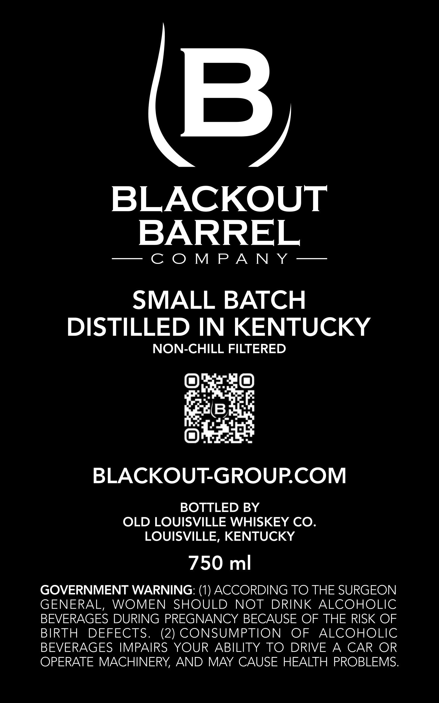
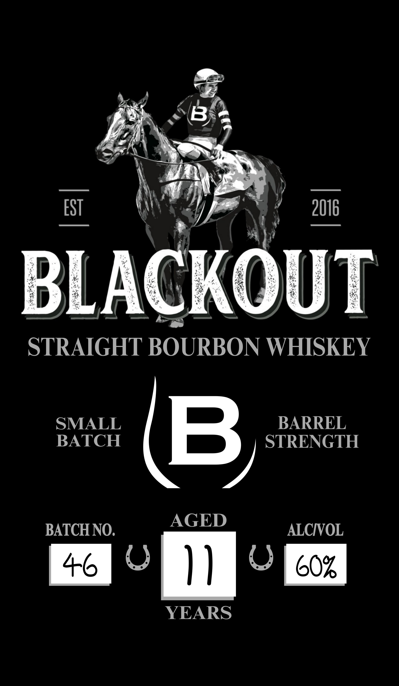

# TTB COLA Label Images - TTBID 26024001000006

**Brand Name:** BLACKOUT

**Issue Date:** 01/26/2026

**Origin Code:** 22

**Product Class/Type:** 101

**Source:** [TTB Public COLA Registry](https://ttbonline.gov/colasonline/viewColaDetails.do?action=publicFormDisplay&ttbid=26024001000006)

## Label Images

### Back Label

### Label 1

## Extracted Label Text

*Text extracted via OCR - may contain errors*

### Back Label

(B,

BLACKOUT

BARREL

—- COMPAN Y —

SMALL BATCH

DISTILLED IN KENTUCKY

NON-CHILL FILTERED

BLACKOUT-GROUP.COM

BOTTLED BY

OLD LOUISVILLE WHISKEY CO.

LOUISVILLE, KENTUCKY

750 ml

GOVERNMENT WARNING: (1) ACCORDING TO THE SURGEON

GENERAL, WOMEN SHOULD NOT DRINK ALCOHOLIC

BEVERAGES DURING PREGNANCY BECAUSE OF THE RISK OF

BIRTH DEFECTS. (2) CONSUMPTION OF ALCOHOLIC

BEVERAGES IMPAIRS YOUR ABILITY TO DRIVE A CAR OR

OPERATE MACHINERY, AND MAY CAUSE HEALTH PROBLEMS

### Label 1

A

STRAIGHT BOURBON WHISKEY

SMALL BARREL
BATCH 4 STRENGTH

BATCH NO. AGED ALCIVOL

+o RN )) Bl coz

YEARS
