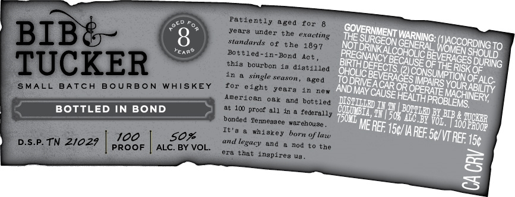
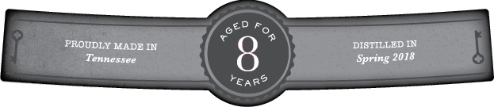

# TTB COLA Label Images - TTBID 26024001000112

**Brand Name:** BIB & TUCKER

**Issue Date:** 02/05/2026

**Origin Code:** 43

**Product Class/Type:** 111

**Source:** [TTB Public COLA Registry](https://ttbonline.gov/colasonline/viewColaDetails.do?action=publicFormDisplay&ttbid=26024001000112)

## Label Images

### Front Label

### Label 2

## Extracted Label Text

*Text extracted via OCR - may contain errors*

### Front Label

NOT!

SURGEON,

DRINK AL

hese

SHOULD

BIRTH Derecre aU

SE OF THe

S DURING

DRIVE,

‘ACAR OR

IMPAIRS V¢

‘OUR,

ALC.

AND May,

Dist

OPERATE

HINERY,

ABILITY

BOTTLED IN BOND

COnmMB TE

FONT py

DOM

iyy 5th

AC BY Vor,

100 Poop

& Wore

### Label 2

oem

PROUDLY MADE IN

DISTILLED IN

Tennessee

Spring 2018

— EAR? a
