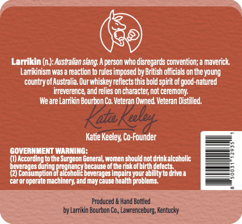
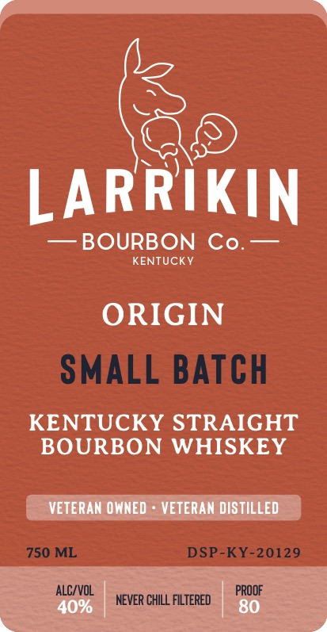

# TTB COLA Label Images - TTBID 26025001000084

**Brand Name:** LARRIKIN BOURBON CO

**Fanciful Name:** ORIGIN SMALL BATCH

**Issue Date:** 01/27/2026

**Origin Code:** 22

**Product Class/Type:** 101

**Source:** [TTB Public COLA Registry](https://ttbonline.gov/colasonline/viewColaDetails.do?action=publicFormDisplay&ttbid=26025001000084)

## Label Images

### Back Label

### Front Label

## Extracted Label Text

*Text extracted via OCR - may contain errors*

### Back Label

Larrikin (n): Australian slang. person who disregards convention; a maverick.

Lariknism was reaction to rules imposed by Bish officials onthe young

country of usta Our whiskey reflect this bod sprit of good-natured

ireverece, and lies on character, not ceremony.

‘Weare Larrikin Bourbon Co. Veteran Owned. Veteran Distilled.

Katie Keeley, Co-Founder

GOVERNMENT WARNING:

1 Acadag ite SryenEaeral wonen soul ot dink acabol:

tow

neta

alcoh

ane because atheist

ems comet

‘aor operate machinery, and may cause he

alesis ayaa:

### Front Label

)

ARR

iKIN

— BOURBON Co.—

KENTUCKY

ORIGIN

KENTUCKY STRAIGHT

BOURBON WHISKEY

| VETERAN OWNED = VETERAN DISTILLED.

ALC/VOL

‘NEVER CHILL FILTERED

PROOF
