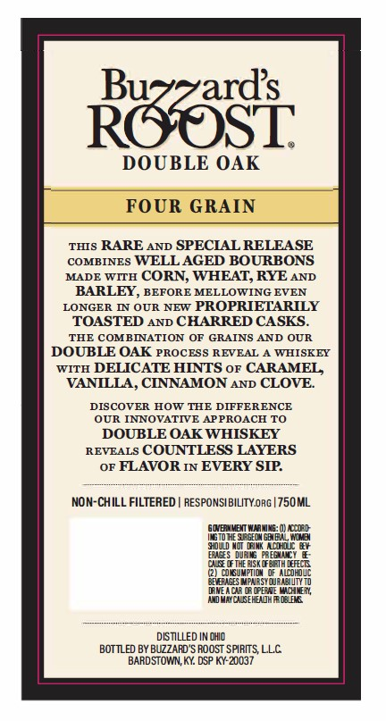
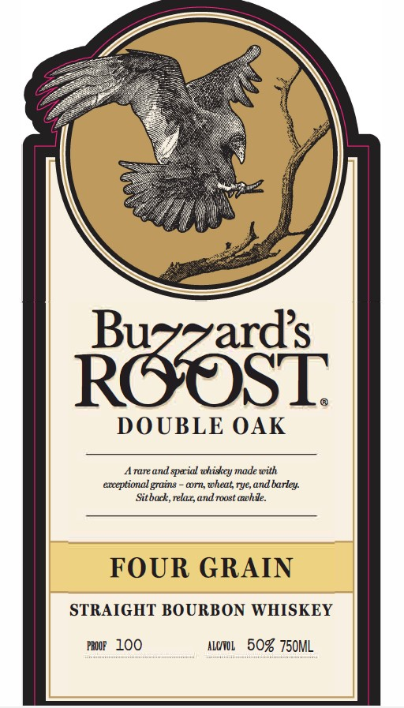

# TTB COLA Label Images - TTBID 26026001000195

**Brand Name:** BUZZARD'S ROOST

**Issue Date:** 01/27/2026

**Origin Code:** 22

**Product Class/Type:** 101

**Source:** [TTB Public COLA Registry](https://ttbonline.gov/colasonline/viewColaDetails.do?action=publicFormDisplay&ttbid=26026001000195)

## Label Images

### Back Label

### Front Label

## Extracted Label Text

*Text extracted via OCR - may contain errors*

### Back Label

ROOSL

DOUBLE OAK

FOUR GRAIN

Tus RARE anp SPECIAL RELEASE

comprnes WELL AGED BOURBONS

MADE wiru CORN, WHEAT, RYE anp

BARLEY, BEFORE MELLOWING EVEN

LONGER IN OUR NEW PROPRIETARILY

TOASTED anp CHARRED CASKS.

THE COMBINATION OF GRAINS AND OUR

DOUBLE OAK Process REVEAL A WHISKEY

witn DELICATE HINTS or CARAMEL,

VANILLA, CINNAMON anp CLOVE.

DISCOVER HOW THE DIFFERENCE

UR INNOVATIVE APPROACH TO

DOUBLE OAK WHISKEY

REVEALS COUNTLESS LAYERS

or FLAVOR 1 EVERY SIP.

NON-CHILL FILTERED | feSPONSLBILTY on |750ML

SEMEN WanM: (CED

(NSO SSSA, WO

AGES URN PREY

‘3000 NOM ACG

CE OFT SK BRT FECTS

(2) CUNT auc

(EVBAS MPMESY UBARLTY TD

IRE AAR Pee MACE,

NOWATCASEREADS ROE.

-

z

2

DSTULED IND

BOTTLED BY BUZZARD'S ROOST SPIRITS, LLC.

BARDSTOWN, KY. DSP KY-20037

### Front Label

ROOST

DOUBLE OAK

Arare and special whiskey made with

exceptional grains - corn, wheat, rye, and barley.

Sitback, relaz, and:

hile

FOUR GRAIN

STRAIGHT BOURBON WHISKEY

ror LOO

alow, 50% 750ML
