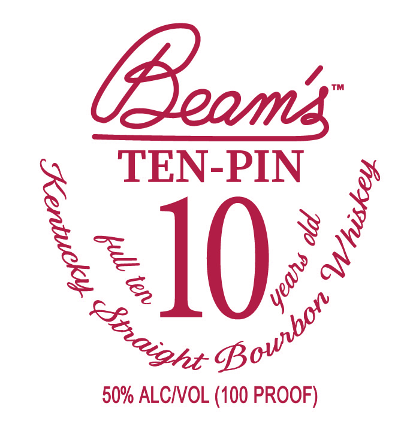
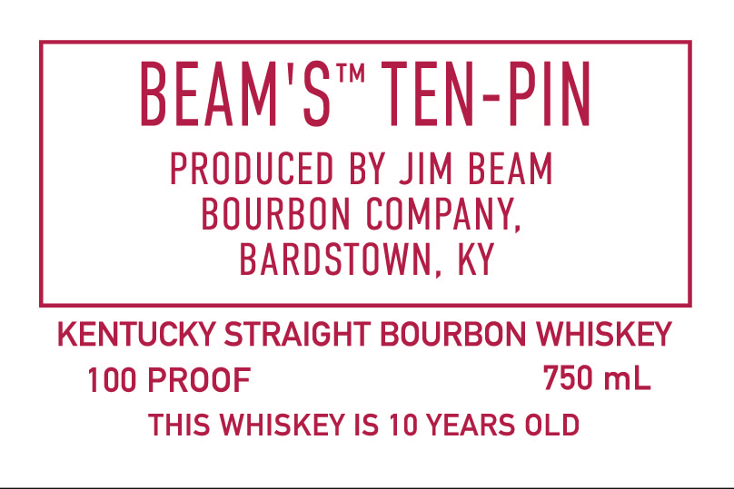
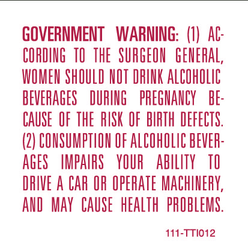
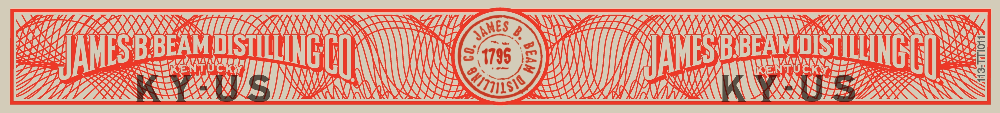

# TTB COLA Label Images - TTBID 26026001000310

**Brand Name:** BEAM'S

**Fanciful Name:** TEN-PIN

**Issue Date:** 01/27/2026

**Origin Code:** 22

**Product Class/Type:** 101

**Source:** [TTB Public COLA Registry](https://ttbonline.gov/colasonline/viewColaDetails.do?action=publicFormDisplay&ttbid=26026001000310)

## Label Images

### Label 1

### Label 2

### Label 3

### Label 4

## Extracted Label Text

*Text extracted via OCR - may contain errors*

*2 image(s) excluded: text did not meet readability threshold*

### Label 2

BEAM'S™ TEN-PIN

PRODUCED BY JIM BEAM

BOURBON COMPANY,

BARDSTOWN, KY

KENTUCKY STRAIGHT BOURBON WHISKEY

100 PROOF

750 mL

THIS WHISKEY IS 10 YEARS OLD

### Label 3

GOVERNMENT WARNING: (1) At

CORDING 10 THE SURGEON GENERAL

WOMEN SHOULD NOT DRINK ALCOHOLIC

BEVERAGES DURING PREGNANCY BE

CAUSE OF THE RISK OF BIRTH DEFECTS

(2) CONSUMPTION OF ALCOHOLIC BEVER

AGES IMPAIRS YOUR ABILITY 10

DRIVE A CAR OR OPERATE MACHINERY,

AND MAY CAUSE HEALTH PROBLEMS

111-TT1012
