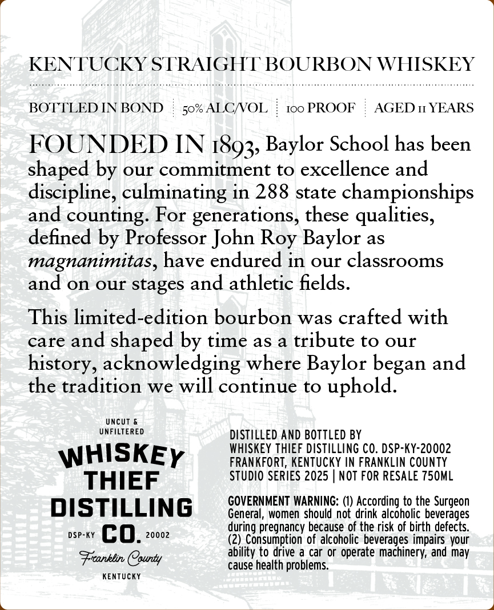
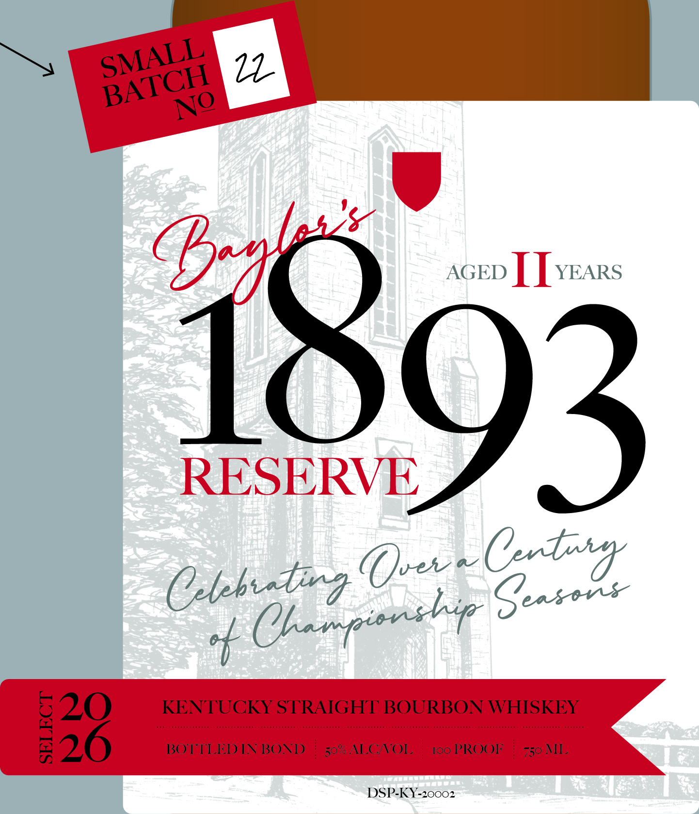

# TTB COLA Label Images - TTBID 26026001000395

**Brand Name:** WHISKEY THIEF DISTILLING CO.

**Fanciful Name:** BAYLOR SCHOOL

**Issue Date:** 01/27/2026

**Origin Code:** 22

**Product Class/Type:** 111

**Source:** [TTB Public COLA Registry](https://ttbonline.gov/colasonline/viewColaDetails.do?action=publicFormDisplay&ttbid=26026001000395)

## Label Images

### Back Label

### Front Label

## Extracted Label Text

*Text extracted via OCR - may contain errors*

### Back Label

SN TUCKY STRAIGHT BOURBON WHISKEY

BOTTLED IN BOND

50% ALC/VOL

100 PROOF | AGED 1 YEARS

FOUNDED IN 1893, Baylor School has been

shaped by our commitment to excellence and

discipline, culminating in 288 state championships

and counting. For generations, these qualities,

defined by Professor John Roy Baylor as

magnanimitas, have endured in our classrooms

and on our stages and athletic fields

This limited-edition bourbon was crafted with

care and shaped by time as a tribute to our

history, acknowledging where Baylor began and

the tradition we will continue to uphold

UNCUT &

UNFILTERED

DISTILLED AND BOTTLED BY

WHISKEY THIEF DISTILLING CO. DSP-KY-20002

WHISKEy

FRANKFORT, KENTUCKY IN FRANKLIN COUNTY

THIEF

STUDIO SERIES 2025 | NOT FOR RESALE 750ML

DISTILLING

GOVERNMENT WARNING: (1) According to the Surgeon

General, women should not drink alcoholic beverages

DSP-KY ca 20002

during pregnancy because of the risk of birth defects.

(2) Consumption of alcoholic beverages impairs your

Frcanklin (Cpunty

ability to drive a car or operate machinery, and may

KENTUCKY

cause health problems.

### Front Label

AGED | [ years

1893

(rx
bbe Cit Gack

DSP-KY-20002
