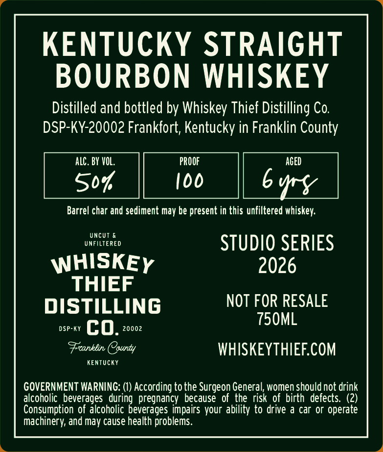
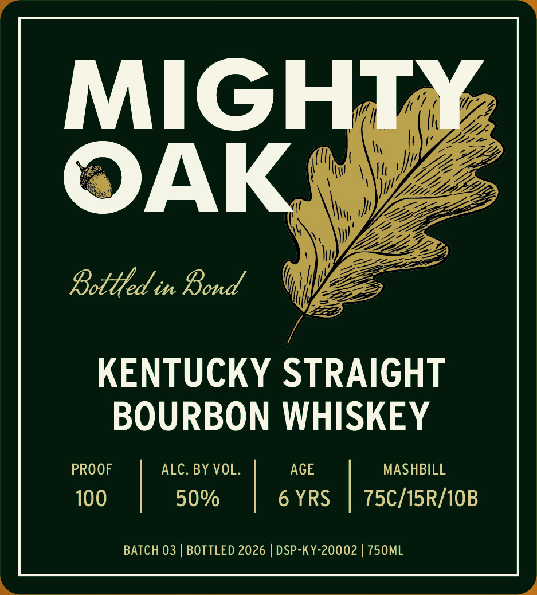

# TTB COLA Label Images - TTBID 26026001000404

**Brand Name:** WHISKEY THIEF DISTILLING CO.

**Fanciful Name:** MIGHTY OAK

**Issue Date:** 01/27/2026

**Origin Code:** 22

**Product Class/Type:** 111

**Source:** [TTB Public COLA Registry](https://ttbonline.gov/colasonline/viewColaDetails.do?action=publicFormDisplay&ttbid=26026001000404)

## Label Images

### Back Label

### Front Label

## Extracted Label Text

*Text extracted via OCR - may contain errors*

### Back Label

KENTUCKY STRAIGHT

BOURBON WHISKEY

Distilled and bottled by Whiskey Thief Distilling Co.

DSP-KY-20002 Frankfort, Kentucky in Franklin County

ALC. BY VOL.

PROOF

AGED

S04

100

bury

Barrel char and sediment may be present in this unfiltered whiskey.

UNFILTERED

UNCUT &

STUDIO SERIES

WHISKEy

2026

THIEF

DISTILLING

NOT FOR RESALE

T50ML

DSP-KY Cc 0. 20002

Freanklin (County

WHISKEYTHIEF.COM

KENTUCKY

GOVERNMENT WARNING: (1) According to the Surgeon General, women should not drink

alcoholic beverages during pregnancy because of the risk of birth defects. (2)

Consumption of alcoholic beverages impairs your ability to drive a car or operate

Machinery, and may cause health problems.

### Front Label

ni &

Z)

MIG

|!

i

Loe

MN

I ! [Pe

ZZ

IW \ YZ

KS

NW

VF

fi

Mh J

II,

AA

Ni \\ Wy

bz

LD

\\ny

A

oe

2,

SSE in foie

MH

y

i(

KENTUCKY STRAIGHT

BOURBON WHISKEY

PROOF

ALC. BY VOL

AGE

MASHBILL

100

50%

6 YRS

|

75C/15R/10B

BATCH 03 | BOTTLED 2026 | DSP-KY-20002 | 750ML
