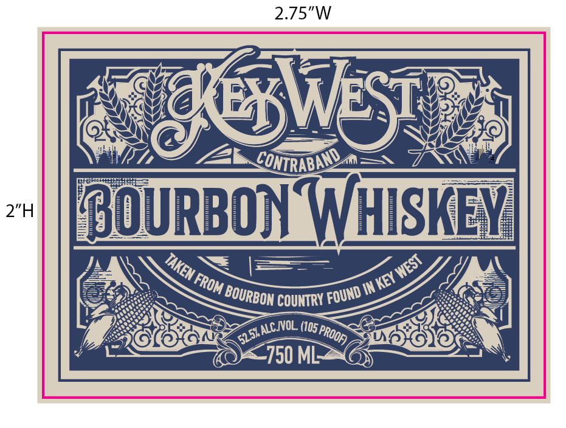
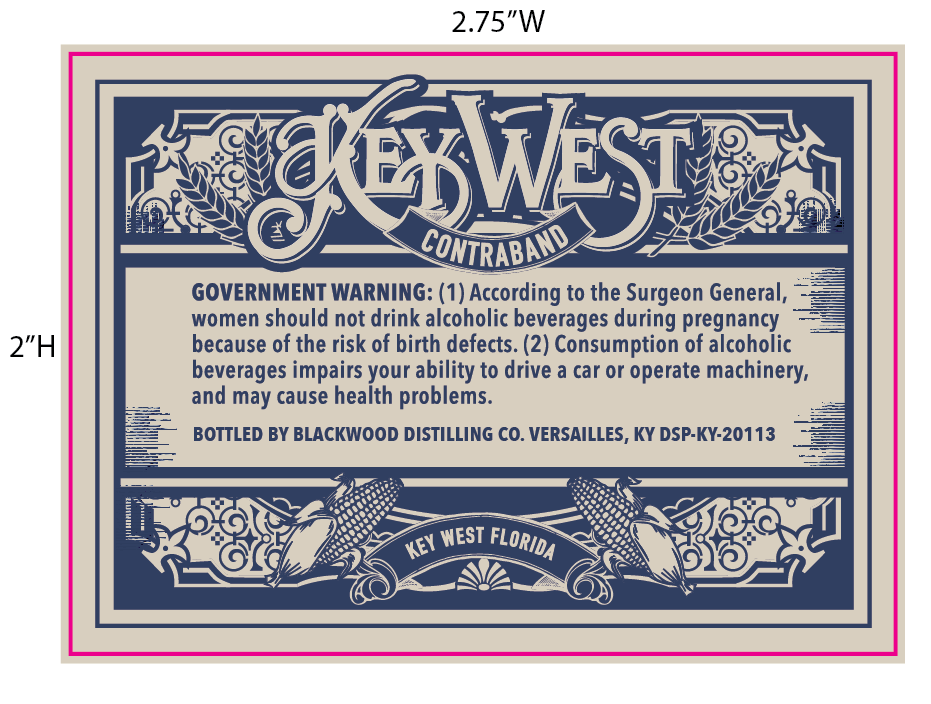

# TTB COLA Label Images - TTBID 26026001000405

**Brand Name:** KEY WEST

**Fanciful Name:** CONTRABAND

**Issue Date:** 01/27/2026

**Origin Code:** 22

**Product Class/Type:** 141

**Source:** [TTB Public COLA Registry](https://ttbonline.gov/colasonline/viewColaDetails.do?action=publicFormDisplay&ttbid=26026001000405)

## Label Images

### Label 1

### Label 2

## Extracted Label Text

*Text extracted via OCR - may contain errors*

*1 image(s) excluded: text did not meet readability threshold*

### Label 2

2.75"W

women should not drink alcoholic beverages during pregnancy —=
2”H because of the risk of birth defects. (2) Consumption of alcoholic

beverages impairs your ability to drive a car or operate machinery,
and may cause health problems.

BOTTLED BY BLACKWOOD DISTILLING CO. VERSAILLES, KY DSP-KY-20113
